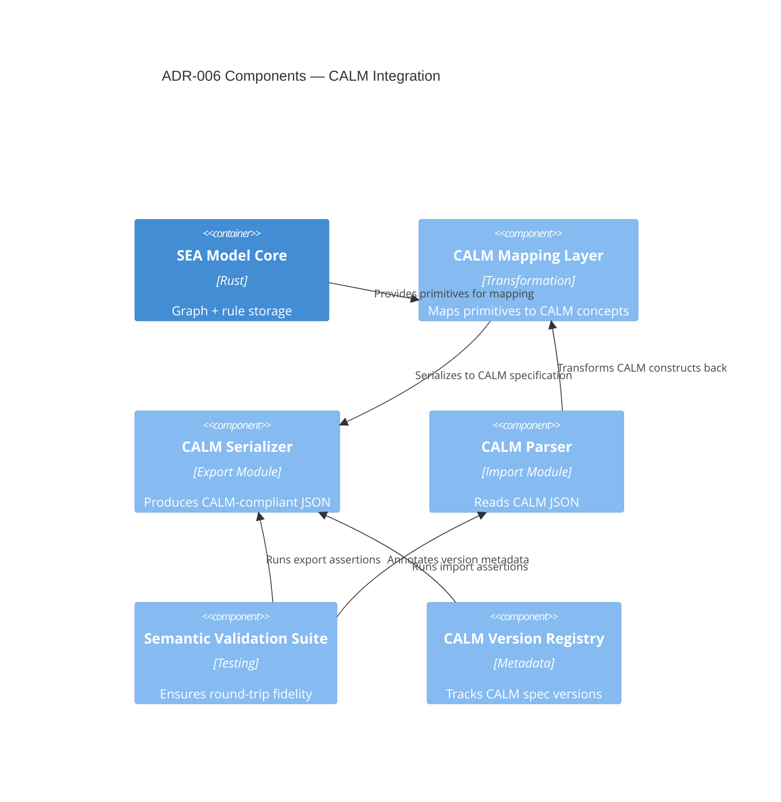

# ADR-006 — CALM Interoperability Components

Component view of the chosen CALM interoperability approach.

```mermaid
%% Source: ADR-006 - CALM Interoperability for Architecture-as-Code
%% Generated: 2025-11-01
%% Section: Decision
%% Diagram: C4Component
%% !include https://raw.githubusercontent.com/plantuml-stdlib/C4-PlantUML/main/C4_Component.puml
C4Component
  title ADR-006 Components — CALM Integration
  Container(modelCore, "SEA Model Core", "Rust", "Graph + rule storage")
  Component(calmMapper, "CALM Mapping Layer", "Transformation", "Maps primitives to CALM concepts")
  Component(jsonSerializer, "CALM Serializer", "Export Module", "Produces CALM-compliant JSON")
  Component(jsonParser, "CALM Parser", "Import Module", "Reads CALM JSON")
  Component(validationSuite, "Semantic Validation Suite", "Testing", "Ensures round-trip fidelity")
  Component(versionRegistry, "CALM Version Registry", "Metadata", "Tracks CALM spec versions")
  Rel(modelCore, calmMapper, "Provides primitives for mapping")
  Rel(calmMapper, jsonSerializer, "Serializes to CALM specification")
  Rel(jsonParser, calmMapper, "Transforms CALM constructs back")
  Rel(validationSuite, jsonSerializer, "Runs export assertions")
  Rel(validationSuite, jsonParser, "Runs import assertions")
  Rel(versionRegistry, jsonSerializer, "Annotates version metadata")
```

- Related: [Interop implementation pipeline](ADR-006-component-calm-pipeline.md)
