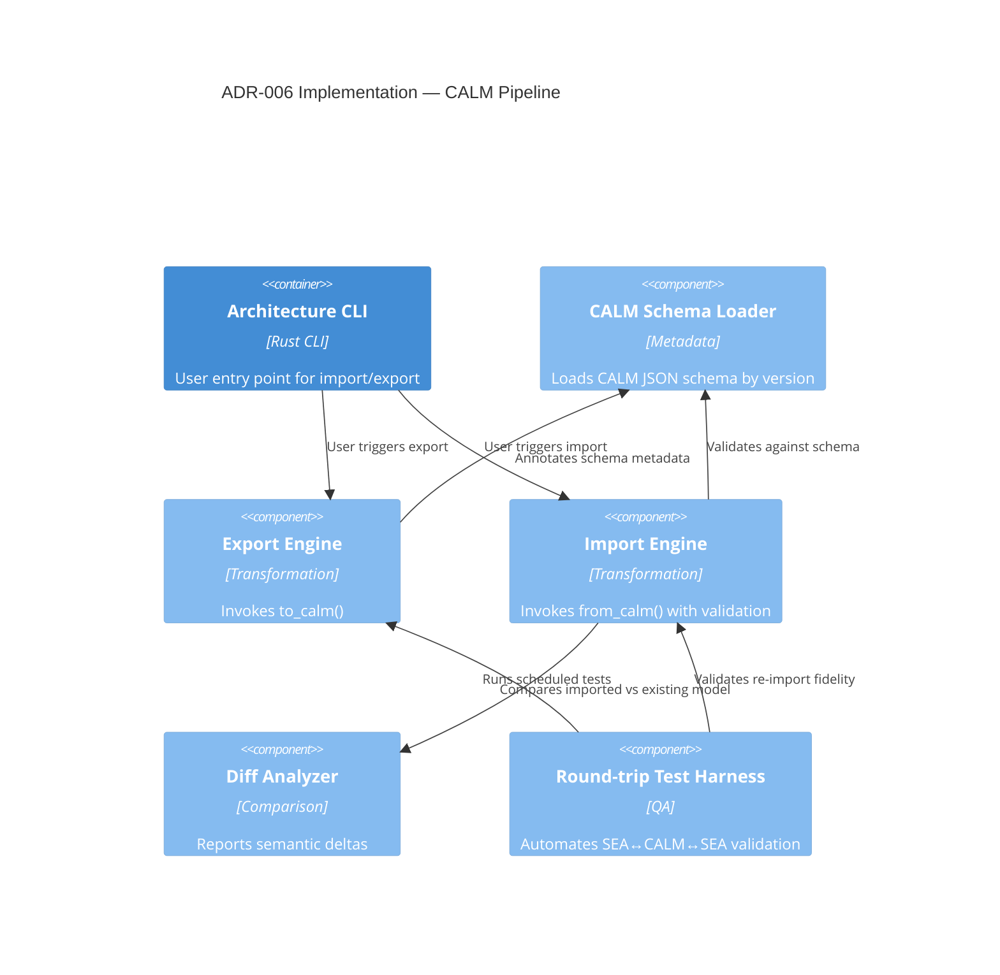

# ADR-006 — CALM Pipeline Components

Implementation-focused component view for executing CALM import/export.

```mermaid
%% Source: ADR-006 - CALM Interoperability for Architecture-as-Code
%% Generated: 2025-11-01
%% Section: Implementation
%% Diagram: C4Component
%% !include https://raw.githubusercontent.com/plantuml-stdlib/C4-PlantUML/main/C4_Component.puml
C4Component
  title ADR-006 Implementation — CALM Pipeline
  Container(cliTooling, "Architecture CLI", "Rust CLI", "User entry point for import/export")
  Component(schemaLoader, "CALM Schema Loader", "Metadata", "Loads CALM JSON schema by version")
  Component(exportEngine, "Export Engine", "Transformation", "Invokes to_calm()")
  Component(importEngine, "Import Engine", "Transformation", "Invokes from_calm() with validation")
  Component(diffAnalyzer, "Diff Analyzer", "Comparison", "Reports semantic deltas")
  Component(testHarness, "Round-trip Test Harness", "QA", "Automates SEA↔CALM↔SEA validation")
  Rel(cliTooling, exportEngine, "User triggers export")
  Rel(cliTooling, importEngine, "User triggers import")
  Rel(exportEngine, schemaLoader, "Annotates schema metadata")
  Rel(importEngine, schemaLoader, "Validates against schema")
  Rel(importEngine, diffAnalyzer, "Compares imported vs existing model")
  Rel(testHarness, exportEngine, "Runs scheduled tests")
  Rel(testHarness, importEngine, "Validates re-import fidelity")
```

- Related: [Round-trip sequence](ADR-006-sequence-roundtrip.md)
