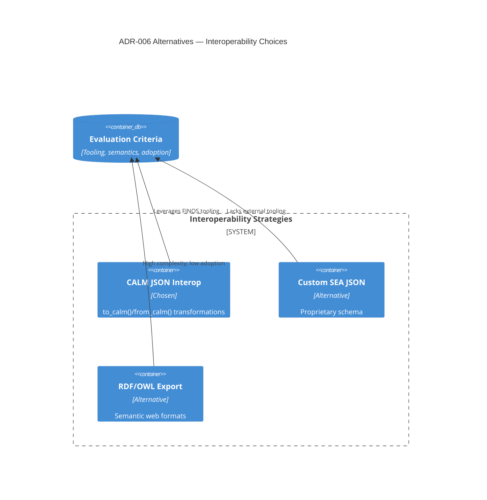

# ADR-006 — Interoperability Options

Container diagram comparing interoperability strategies assessed in ADR-006.

```mermaid
%% Source: ADR-006 - CALM Interoperability for Architecture-as-Code
%% Generated: 2025-11-01
%% Section: Alternatives
%% Diagram: C4Container
%% !include https://raw.githubusercontent.com/plantuml-stdlib/C4-PlantUML/main/C4_Container.puml
C4Container
  title ADR-006 Alternatives — Interoperability Choices
  System_Boundary(options, "Interoperability Strategies") {
    Container(calmInterop, "CALM JSON Interop", "Chosen", "to_calm()/from_calm() transformations")
    Container(customJson, "Custom SEA JSON", "Alternative", "Proprietary schema")
    Container(rdfInterop, "RDF/OWL Export", "Alternative", "Semantic web formats")
  }
  ContainerDb(assessment, "Evaluation Criteria", "Tooling, semantics, adoption")
  Rel(calmInterop, assessment, "Leverages FINOS tooling")
  Rel(customJson, assessment, "Lacks external tooling")
  Rel(rdfInterop, assessment, "High complexity; low adoption")
```

- Related: [Decision evaluation flow](ADR-006-flow-decision-path.md)
