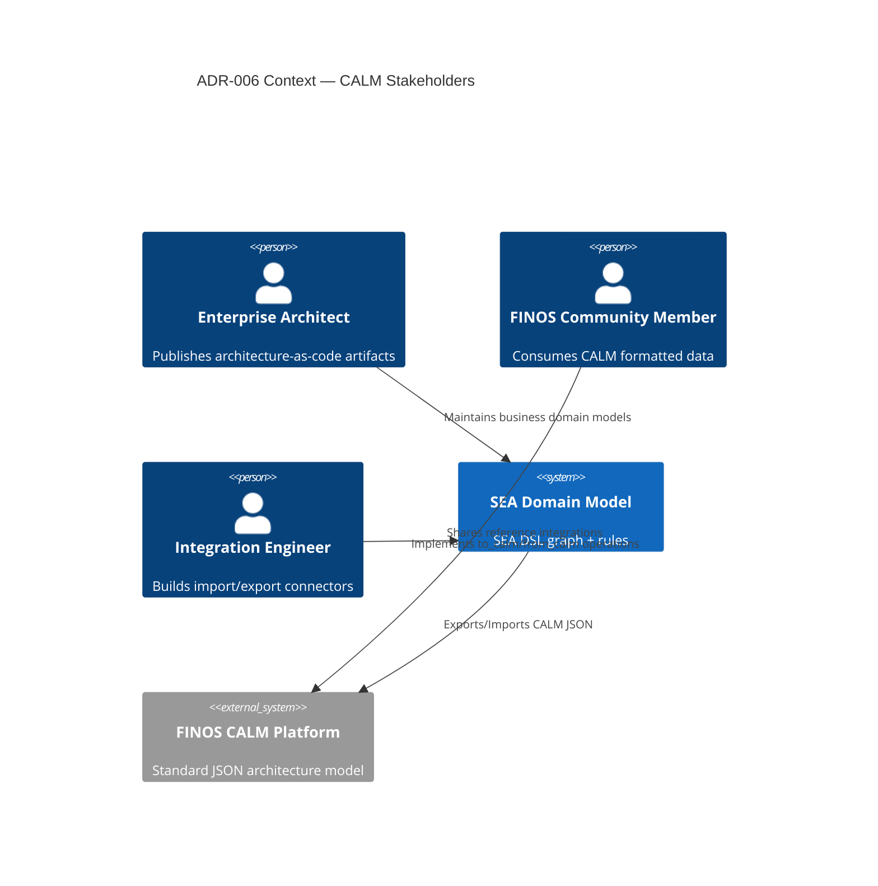

# ADR-006 — CALM Integration Context

Context diagram depicting who drives CALM interoperability requirements.

```mermaid
%% Source: ADR-006 - CALM Interoperability for Architecture-as-Code
%% Generated: 2025-11-01
%% Section: Context
%% Diagram: C4Context
%% !include https://raw.githubusercontent.com/plantuml-stdlib/C4-PlantUML/main/C4_Context.puml
C4Context
  title ADR-006 Context — CALM Stakeholders
  Person(enterpriseArchitect, "Enterprise Architect", "Publishes architecture-as-code artifacts")
  Person(finosCommunity, "FINOS Community Member", "Consumes CALM formatted data")
  Person(integrationEngineer, "Integration Engineer", "Builds import/export connectors")
  System(seaModel, "SEA Domain Model", "SEA DSL graph + rules")
  System_Ext(finosCalm, "FINOS CALM Platform", "Standard JSON architecture model")
  Rel(enterpriseArchitect, seaModel, "Maintains business domain models")
  Rel(seaModel, finosCalm, "Exports/Imports CALM JSON")
  Rel(finosCommunity, finosCalm, "Shares reference integrations")
  Rel(integrationEngineer, seaModel, "Implements to_calm/from_calm operations")
```

- Related: [Context pressure flow](ADR-006-flow-context-pressures.md)
