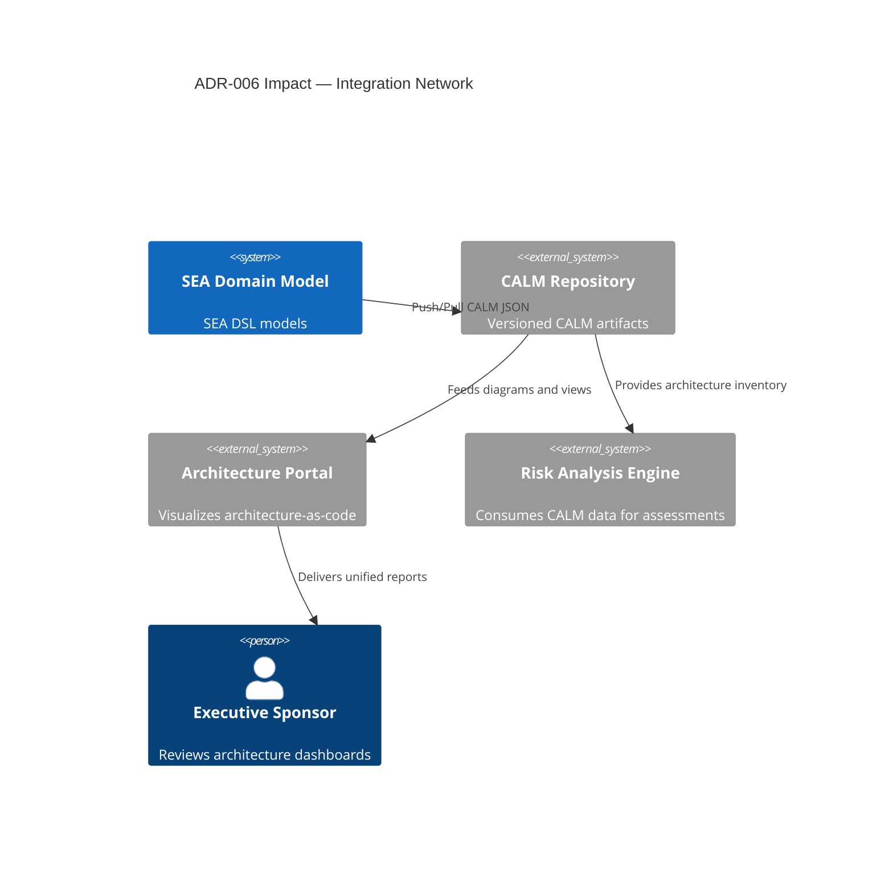

# ADR-006 — Integration Network Context

Context diagram of systems benefiting from CALM export/import.

```mermaid
%% Source: ADR-006 - CALM Interoperability for Architecture-as-Code
%% Generated: 2025-11-01
%% Section: Impact
%% Diagram: C4Context
%% !include https://raw.githubusercontent.com/plantuml-stdlib/C4-PlantUML/main/C4_Context.puml
C4Context
  title ADR-006 Impact — Integration Network
  System(seaModel, "SEA Domain Model", "SEA DSL models")
  System_Ext(calmRepo, "CALM Repository", "Versioned CALM artifacts")
  System_Ext(archPortal, "Architecture Portal", "Visualizes architecture-as-code")
  System_Ext(riskEngine, "Risk Analysis Engine", "Consumes CALM data for assessments")
  Person(execSponsor, "Executive Sponsor", "Reviews architecture dashboards")
  Rel(seaModel, calmRepo, "Push/Pull CALM JSON")
  Rel(calmRepo, archPortal, "Feeds diagrams and views")
  Rel(calmRepo, riskEngine, "Provides architecture inventory")
  Rel(archPortal, execSponsor, "Delivers unified reports")
```

- Related: [Integration impact flow](ADR-006-flow-impact-integration.md)
