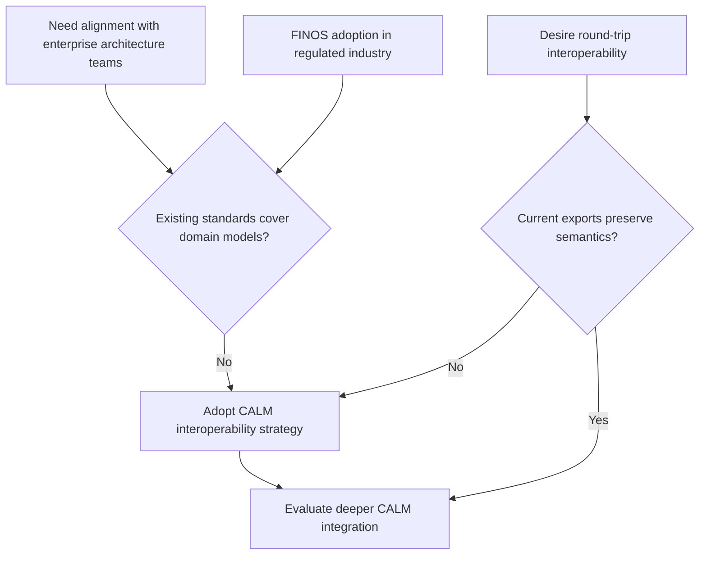

# ADR-006 — Context Pressure Flow

Flowchart showing forces that motivate CALM support.

```mermaid
%% Source: ADR-006 - CALM Interoperability for Architecture-as-Code
%% Generated: 2025-11-01
%% Section: Context
%% Diagram: Flowchart
graph TD
  A[Need alignment with enterprise architecture teams] --> B{Existing standards cover domain models?}
  C[FINOS adoption in regulated industry] --> B
  D[Desire round-trip interoperability] --> E{Current exports preserve semantics?}
  B -->|No| F[Adopt CALM interoperability strategy]
  E -->|No| F
  E -->|Yes| G[Evaluate deeper CALM integration]
  F --> G
```

- Related: [Interoperability options](ADR-006-container-interoperability-options.md)
