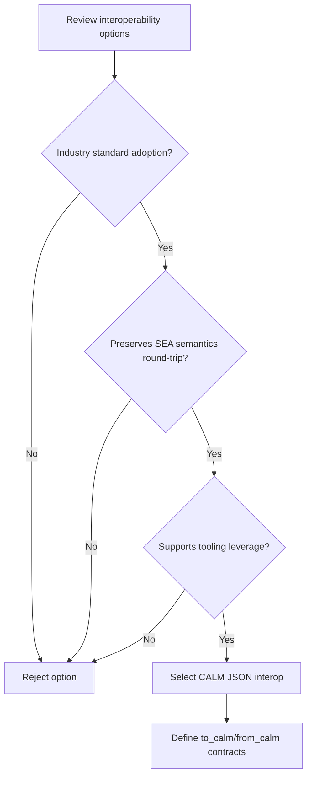

# ADR-006 — Decision Path Flow

Flowchart depicting how CALM interoperability satisfies decision criteria.

```mermaid
%% Source: ADR-006 - CALM Interoperability for Architecture-as-Code
%% Generated: 2025-11-01
%% Section: Decision
%% Diagram: Flowchart
graph TD
  A[Review interoperability options] --> B{Industry standard adoption?}
  B -->|No| C[Reject option]
  B -->|Yes| D{Preserves SEA semantics round-trip?}
  D -->|No| C
  D -->|Yes| E{Supports tooling leverage?}
  E -->|No| C
  E -->|Yes| F[Select CALM JSON interop]
  F --> G[Define to_calm/from_calm contracts]
```

- Related: [CALM component architecture](ADR-006-component-calm-architecture.md)
