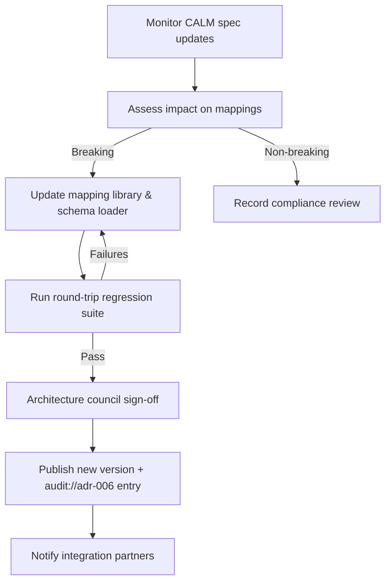

# ADR-006 — CALM Governance Flow

Workflow ensuring CALM mappings and exports remain compliant with evolving specifications.

- Related: [CALM pipeline components](ADR-006-component-calm-pipeline.md)
