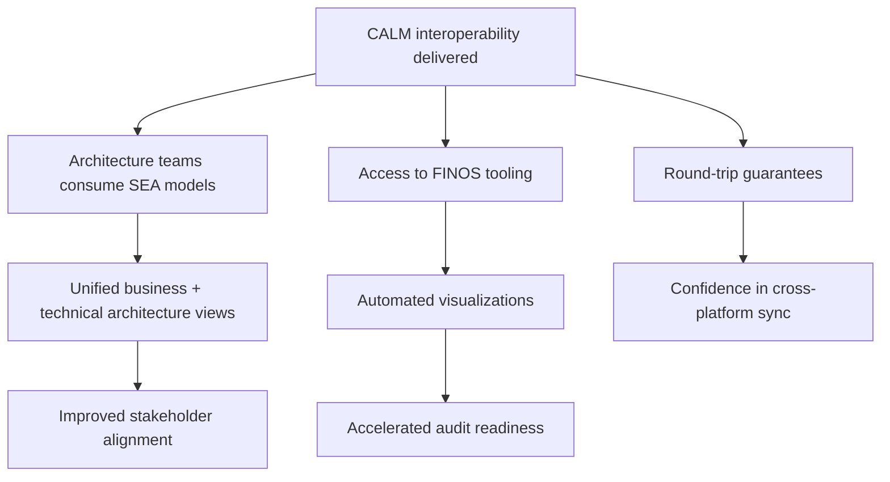

# ADR-006 — Integration Impact Flow

Flowchart capturing the enterprise integration benefits of CALM support.

```mermaid
%% Source: ADR-006 - CALM Interoperability for Architecture-as-Code
%% Generated: 2025-11-01
%% Section: Impact
%% Diagram: Flowchart
graph TD
  A[CALM interoperability delivered] --> B[Architecture teams consume SEA models]
  A --> C[Access to FINOS tooling]
  B --> D[Unified business + technical architecture views]
  D --> E[Improved stakeholder alignment]
  C --> F[Automated visualizations]
  F --> G[Accelerated audit readiness]
  A --> H[Round-trip guarantees]
  H --> I[Confidence in cross-platform sync]
```

- Related: [Integration context view](ADR-006-context-impact-network.md)
