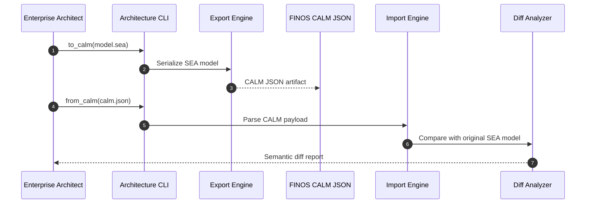

# ADR-006 — CALM Round-Trip Sequence

Sequence outlines how models undergo CALM export and re-import to guarantee semantic preservation.

- Related: [CALM pipeline components](ADR-006-component-calm-pipeline.md)
