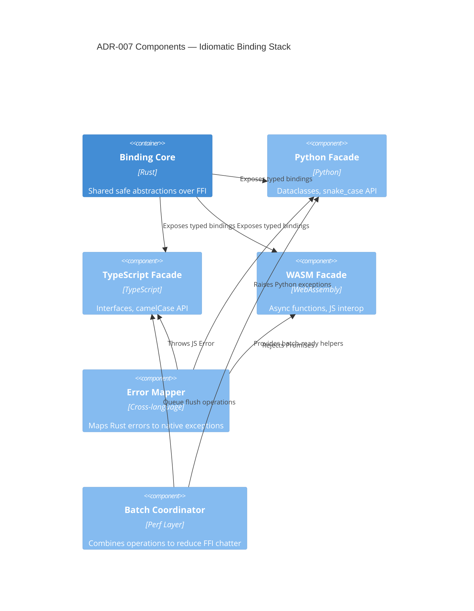

# ADR-007 — Binding Architecture Components

Component view of language-specific binding layers supporting idiomatic experiences.

- Related: [Binding implementation pipeline](ADR-007-component-binding-pipeline.md)
