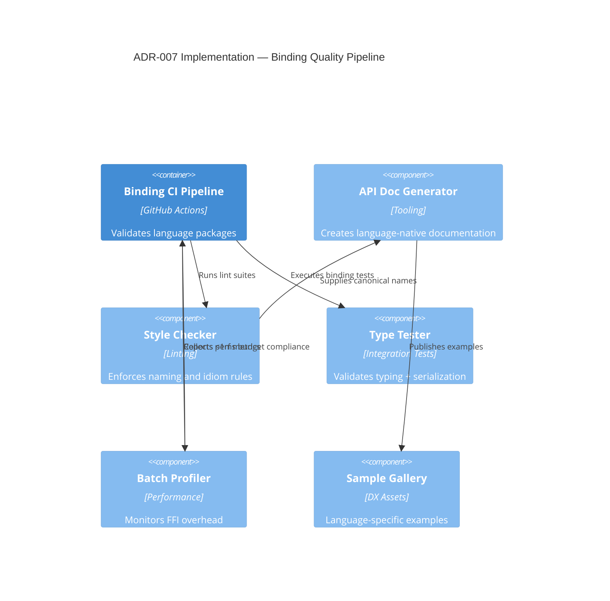

# ADR-007 — Binding Pipeline Components

Implementation view covering tooling that enforces idiomatic conventions.

```mermaid
%% Source: ADR-007 - Idiomatic Language-Specific Bindings
%% Generated: 2025-11-01
%% Section: Implementation
%% Diagram: C4Component
%% !include https://raw.githubusercontent.com/plantuml-stdlib/C4-PlantUML/main/C4_Component.puml
C4Component
  title ADR-007 Implementation — Binding Quality Pipeline
  Container(ciPipeline, "Binding CI Pipeline", "GitHub Actions", "Validates language packages")
  Component(docGen, "API Doc Generator", "Tooling", "Creates language-native documentation")
  Component(styleChecker, "Style Checker", "Linting", "Enforces naming and idiom rules")
  Component(typeTester, "Type Tester", "Integration Tests", "Validates typing + serialization")
  Component(batchProfiler, "Batch Profiler", "Performance", "Monitors FFI overhead")
  Component(sampleGallery, "Sample Gallery", "DX Assets", "Language-specific examples")
  Rel(ciPipeline, styleChecker, "Runs lint suites")
  Rel(ciPipeline, typeTester, "Executes binding tests")
  Rel(ciPipeline, batchProfiler, "Collects perf metrics")
  Rel(styleChecker, docGen, "Supplies canonical names")
  Rel(docGen, sampleGallery, "Publishes examples")
  Rel(batchProfiler, ciPipeline, "Reports <1ms budget compliance")
```

- Related: [TypeScript async sequence](ADR-007-sequence-typescript-call.md)
