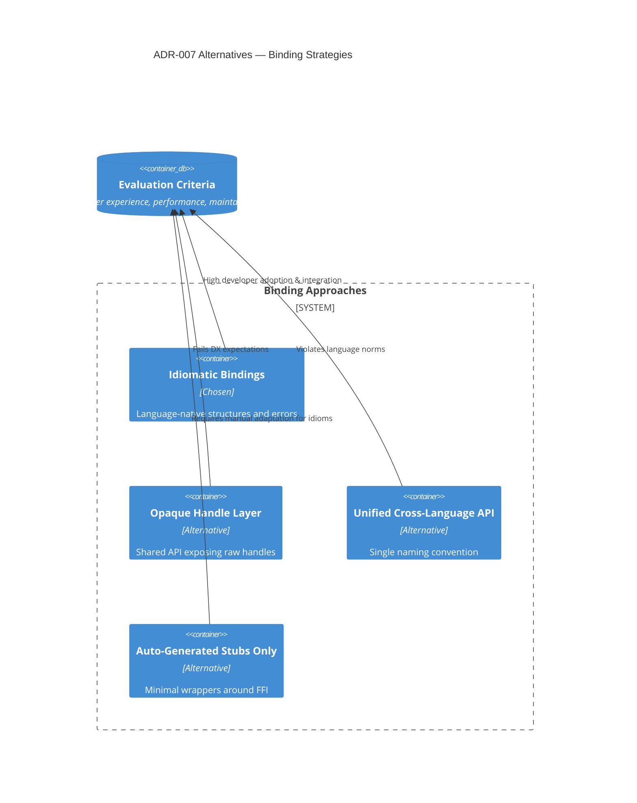

# ADR-007 — Binding Strategy Options

Container diagram contrasting idiomatic bindings with alternative strategies.

```mermaid
%% Source: ADR-007 - Idiomatic Language-Specific Bindings
%% Generated: 2025-11-01
%% Section: Alternatives
%% Diagram: C4Container
%% !include https://raw.githubusercontent.com/plantuml-stdlib/C4-PlantUML/main/C4_Container.puml
C4Container
  title ADR-007 Alternatives — Binding Strategies
  System_Boundary(options, "Binding Approaches") {
    Container(idiomatic, "Idiomatic Bindings", "Chosen", "Language-native structures and errors")
    Container(opaqueHandles, "Opaque Handle Layer", "Alternative", "Shared API exposing raw handles")
    Container(unifiedApi, "Unified Cross-Language API", "Alternative", "Single naming convention")
    Container(codeGen, "Auto-Generated Stubs Only", "Alternative", "Minimal wrappers around FFI")
  }
  ContainerDb(criteria, "Evaluation Criteria", "Developer experience, performance, maintainability")
  Rel(idiomatic, criteria, "High developer adoption & integration")
  Rel(opaqueHandles, criteria, "Fails DX expectations")
  Rel(unifiedApi, criteria, "Violates language norms")
  Rel(codeGen, criteria, "Requires manual adaptation for idioms")
```

- Related: [Decision reasoning flow](ADR-007-flow-decision-logic.md)
