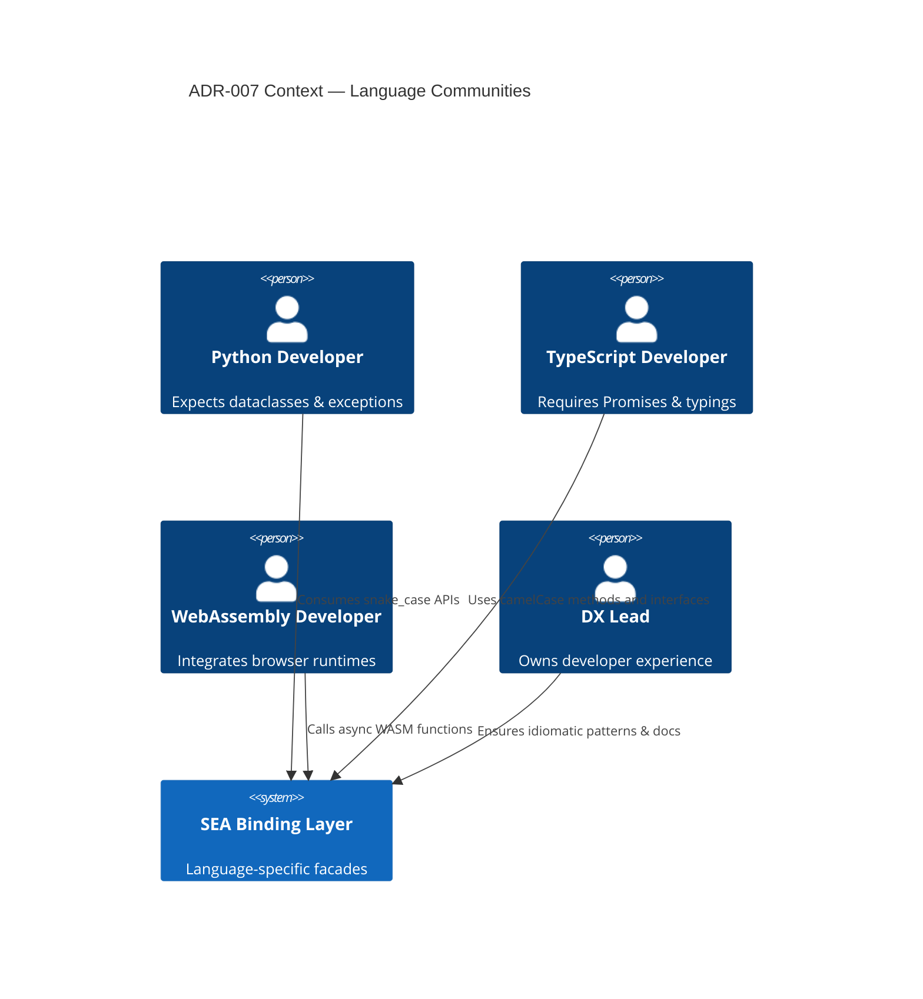

# ADR-007 — Idiomatic Binding Context

Context diagram showing developer communities demanding idiomatic APIs.

```mermaid
%% Source: ADR-007 - Idiomatic Language-Specific Bindings
%% Generated: 2025-11-01
%% Section: Context
%% Diagram: C4Context
%% !include https://raw.githubusercontent.com/plantuml-stdlib/C4-PlantUML/main/C4_Context.puml
C4Context
  title ADR-007 Context — Language Communities
  Person(pythonDev, "Python Developer", "Expects dataclasses & exceptions")
  Person(tsDev, "TypeScript Developer", "Requires Promises & typings")
  Person(wasmDev, "WebAssembly Developer", "Integrates browser runtimes")
  Person(dxLead, "DX Lead", "Owns developer experience")
  System(bindingLayer, "SEA Binding Layer", "Language-specific facades")
  Rel(pythonDev, bindingLayer, "Consumes snake_case APIs")
  Rel(tsDev, bindingLayer, "Uses camelCase methods and interfaces")
  Rel(wasmDev, bindingLayer, "Calls async WASM functions")
  Rel(dxLead, bindingLayer, "Ensures idiomatic patterns & docs")
```

- Related: [Context pressure flow](ADR-007-flow-context-pressures.md)
