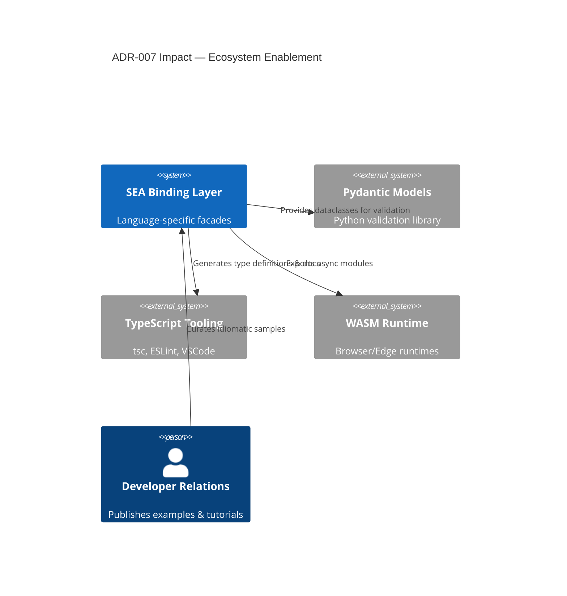

# ADR-007 — Ecosystem Impact Context

Context diagram of ecosystem tools and communities impacted by idiomatic bindings.

```mermaid
%% Source: ADR-007 - Idiomatic Language-Specific Bindings
%% Generated: 2025-11-01
%% Section: Impact
%% Diagram: C4Context
%% !include https://raw.githubusercontent.com/plantuml-stdlib/C4-PlantUML/main/C4_Context.puml
C4Context
  title ADR-007 Impact — Ecosystem Enablement
  System(bindingLayer, "SEA Binding Layer", "Language-specific facades")
  System_Ext(pydantic, "Pydantic Models", "Python validation library")
  System_Ext(tsTooling, "TypeScript Tooling", "tsc, ESLint, VSCode")
  System_Ext(wasmRuntime, "WASM Runtime", "Browser/Edge runtimes")
  Person(devRel, "Developer Relations", "Publishes examples & tutorials")
  Rel(bindingLayer, pydantic, "Provides dataclasses for validation")
  Rel(bindingLayer, tsTooling, "Generates type definitions & docs")
  Rel(bindingLayer, wasmRuntime, "Exports async modules")
  Rel(devRel, bindingLayer, "Curates idiomatic samples")
```

- Related: [Adoption impact flow](ADR-007-flow-impact-adoption.md)
