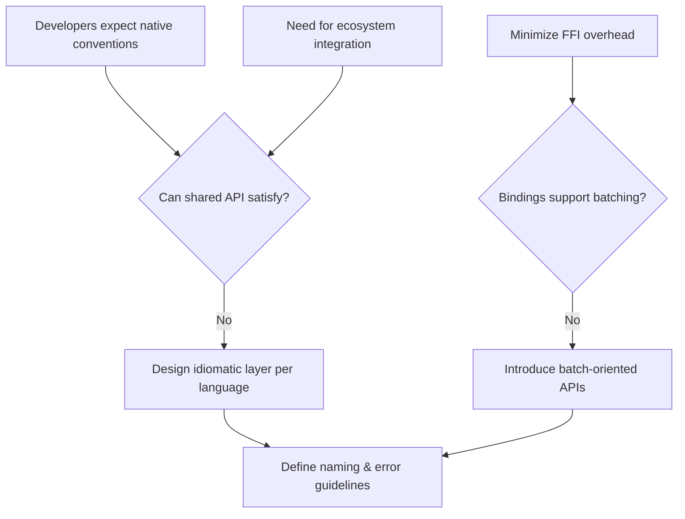

# ADR-007 — Context Pressure Flow

Flowchart highlighting experience and performance pressures addressed by idiomatic bindings.

- Related: [Binding strategy options](ADR-007-container-binding-options.md)
