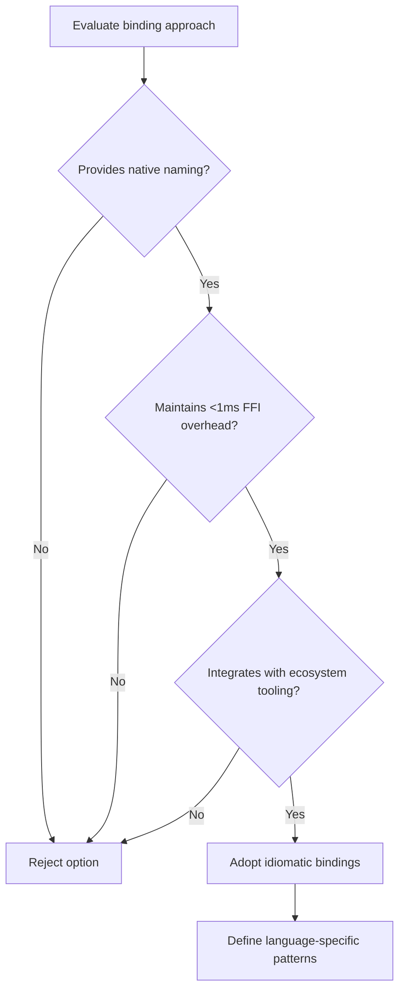

# ADR-007 — Decision Logic Flow

Flowchart describing the evaluation of binding strategies.

```mermaid
%% Source: ADR-007 - Idiomatic Language-Specific Bindings
%% Generated: 2025-11-01
%% Section: Decision
%% Diagram: Flowchart
graph TD
  A[Evaluate binding approach] --> B{Provides native naming?}
  B -->|No| C[Reject option]
  B -->|Yes| D{Maintains <1ms FFI overhead?}
  D -->|No| C
  D -->|Yes| E{Integrates with ecosystem tooling?}
  E -->|No| C
  E -->|Yes| F[Adopt idiomatic bindings]
  F --> G[Define language-specific patterns]
```

- Related: [Binding component responsibilities](ADR-007-component-binding-architecture.md)
