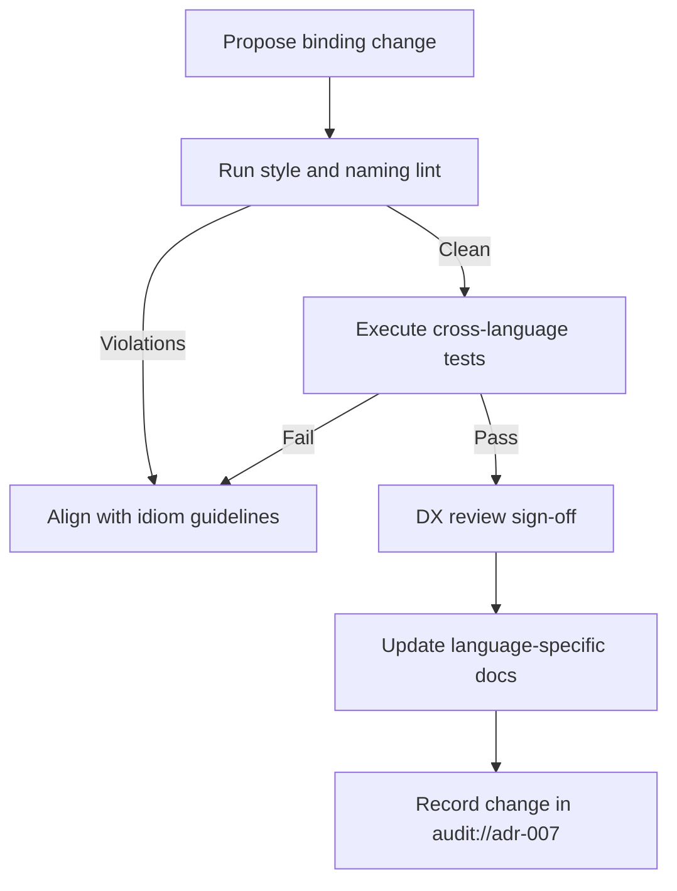

# ADR-007 — Binding Quality Governance Flow

Workflow ensuring idiomatic standards remain enforced across languages.

- Related: [Binding pipeline components](ADR-007-component-binding-pipeline.md)
