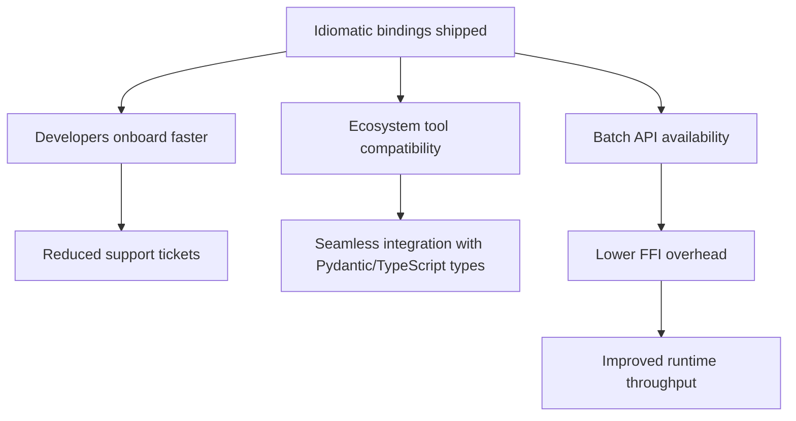

# ADR-007 — Adoption Impact Flow

Flowchart depicting adoption and productivity outcomes from idiomatic bindings.

```mermaid
%% Source: ADR-007 - Idiomatic Language-Specific Bindings
%% Generated: 2025-11-01
%% Section: Impact
%% Diagram: Flowchart
graph TD
  A[Idiomatic bindings shipped] --> B[Developers onboard faster]
  B --> C[Reduced support tickets]
  A --> D[Ecosystem tool compatibility]
  D --> E[Seamless integration with Pydantic/TypeScript types]
  A --> F[Batch API availability]
  F --> G[Lower FFI overhead]
  G --> H[Improved runtime throughput]
```

- Related: [Ecosystem context view](ADR-007-context-impact-ecosystem.md)
