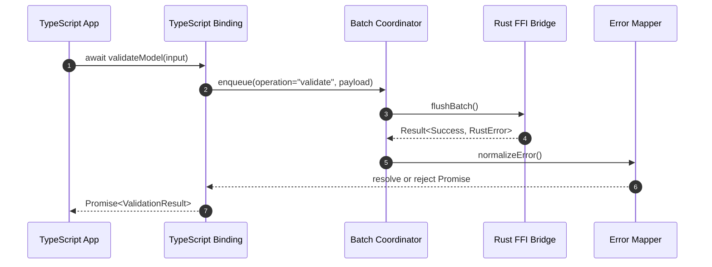

# ADR-007 — TypeScript Async Call Sequence

Sequence illustrates how the TypeScript binding surfaces an idiomatic Promise-based API.

- Related: [Binding pipeline components](ADR-007-component-binding-pipeline.md)
