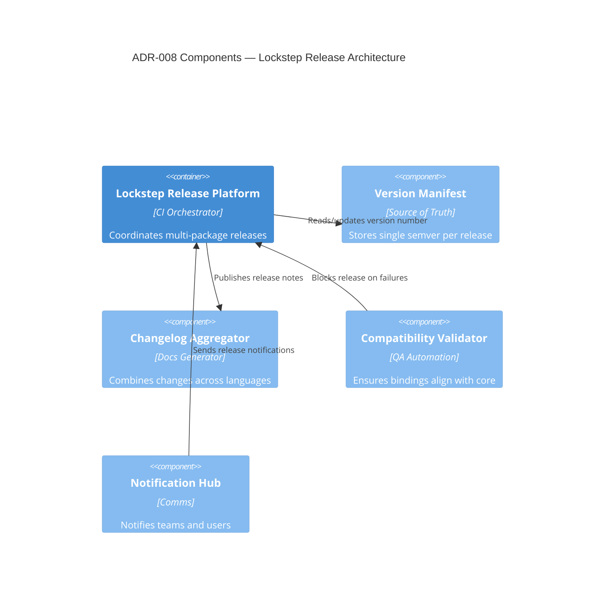

# ADR-008 — Lockstep Architecture Components

Component view describing how the lockstep strategy is enforced architecturally.

- Related: [Release pipeline implementation](ADR-008-component-release-pipeline.md)
