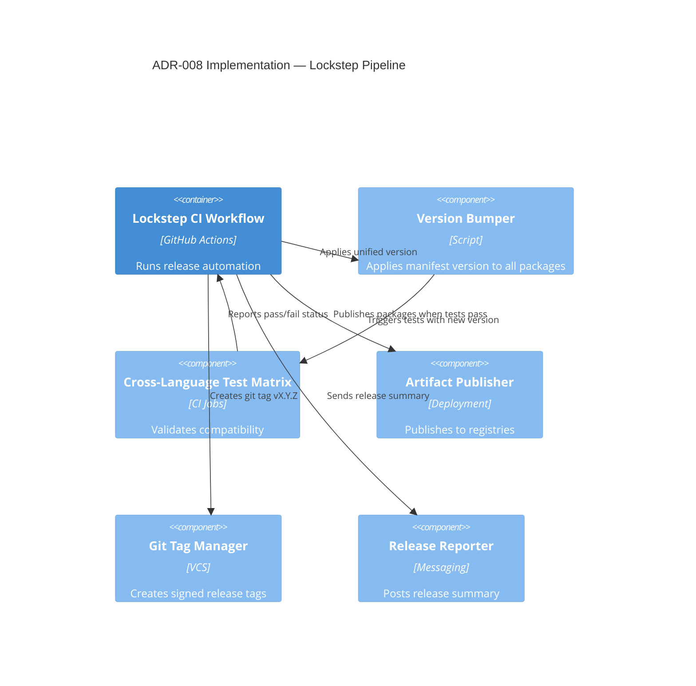

# ADR-008 — Release Pipeline Components

Implementation component view for executing synchronized releases.

```mermaid
%% Source: ADR-008 - Lockstep Versioning Strategy
%% Generated: 2025-11-01
%% Section: Implementation
%% Diagram: C4Component
%% !include https://raw.githubusercontent.com/plantuml-stdlib/C4-PlantUML/main/C4_Component.puml
C4Component
  title ADR-008 Implementation — Lockstep Pipeline
  Container(ciPipeline, "Lockstep CI Workflow", "GitHub Actions", "Runs release automation")
  Component(versionBumper, "Version Bumper", "Script", "Applies manifest version to all packages")
  Component(testMatrix, "Cross-Language Test Matrix", "CI Jobs", "Validates compatibility")
  Component(artifactPublisher, "Artifact Publisher", "Deployment", "Publishes to registries")
  Component(tagManager, "Git Tag Manager", "VCS", "Creates signed release tags")
  Component(releaseReporter, "Release Reporter", "Messaging", "Posts release summary")
  Rel(ciPipeline, versionBumper, "Applies unified version")
  Rel(versionBumper, testMatrix, "Triggers tests with new version")
  Rel(testMatrix, ciPipeline, "Reports pass/fail status")
  Rel(ciPipeline, artifactPublisher, "Publishes packages when tests pass")
  Rel(ciPipeline, tagManager, "Creates git tag vX.Y.Z")
  Rel(ciPipeline, releaseReporter, "Sends release summary")
```

- Related: [Release cadence sequence](ADR-008-sequence-release-cadence.md)
