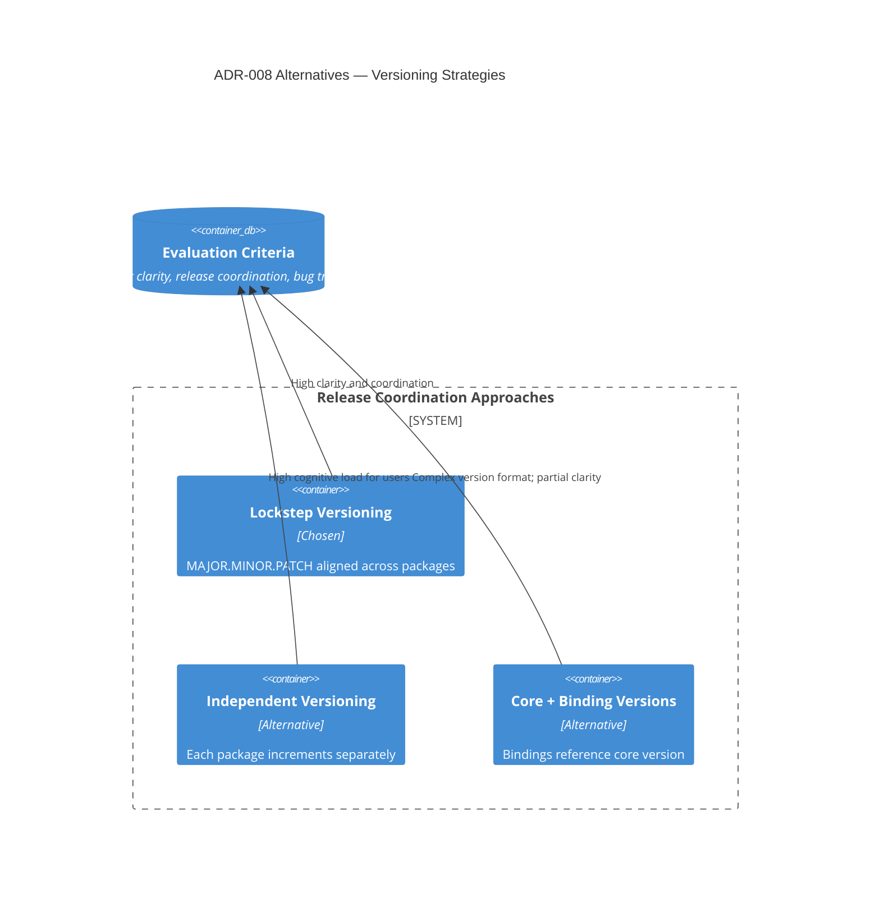

# ADR-008 — Versioning Options

Container diagram comparing alternative versioning strategies.

```mermaid
%% Source: ADR-008 - Lockstep Versioning Strategy
%% Generated: 2025-11-01
%% Section: Alternatives
%% Diagram: C4Container
%% !include https://raw.githubusercontent.com/plantuml-stdlib/C4-PlantUML/main/C4_Container.puml
C4Container
  title ADR-008 Alternatives — Versioning Strategies
  System_Boundary(options, "Release Coordination Approaches") {
    Container(lockstep, "Lockstep Versioning", "Chosen", "MAJOR.MINOR.PATCH aligned across packages")
    Container(independent, "Independent Versioning", "Alternative", "Each package increments separately")
    Container(coreRef, "Core + Binding Versions", "Alternative", "Bindings reference core version")
  }
  ContainerDb(criteria, "Evaluation Criteria", "User clarity, release coordination, bug triage")
  Rel(lockstep, criteria, "High clarity and coordination")
  Rel(independent, criteria, "High cognitive load for users")
  Rel(coreRef, criteria, "Complex version format; partial clarity")
```

- Related: [Decision logic flow](ADR-008-flow-decision-logic.md)
