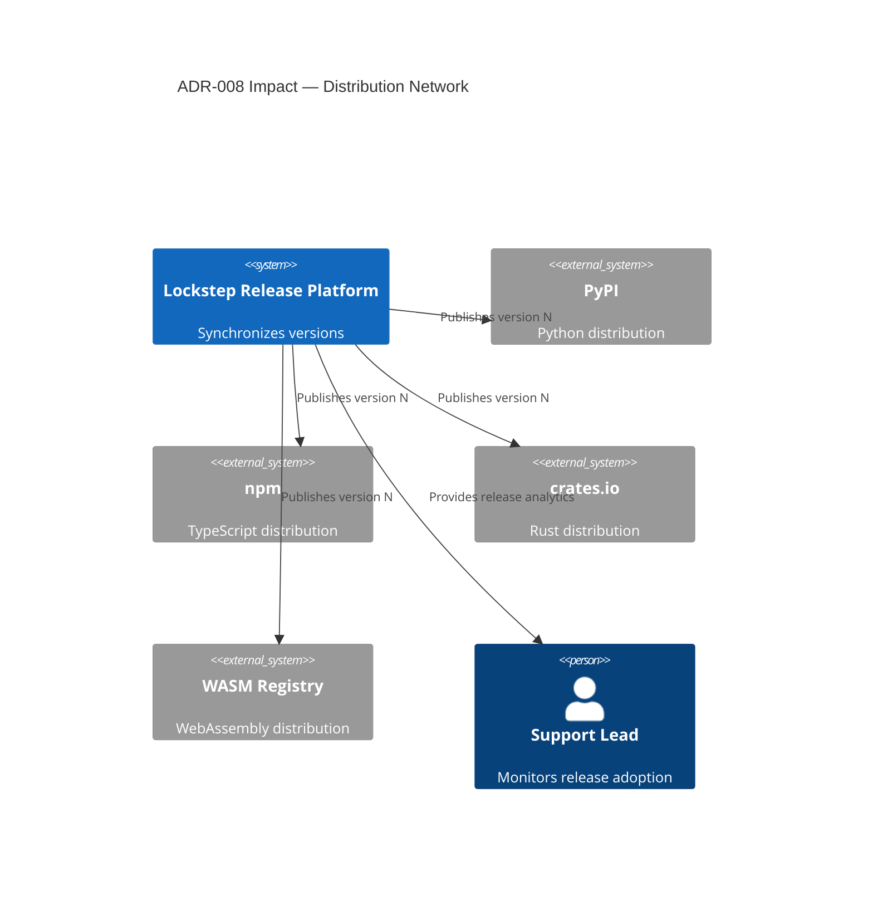

# ADR-008 — Distribution Impact Context

Context diagram of distribution channels that rely on lockstep versioning.

```mermaid
%% Source: ADR-008 - Lockstep Versioning Strategy
%% Generated: 2025-11-01
%% Section: Impact
%% Diagram: C4Context
%% !include https://raw.githubusercontent.com/plantuml-stdlib/C4-PlantUML/main/C4_Context.puml
C4Context
  title ADR-008 Impact — Distribution Network
  System(lockstepRelease, "Lockstep Release Platform", "Synchronizes versions")
  System_Ext(pyPI, "PyPI", "Python distribution")
  System_Ext(npm, "npm", "TypeScript distribution")
  System_Ext(crates, "crates.io", "Rust distribution")
  System_Ext(wasmRegistry, "WASM Registry", "WebAssembly distribution")
  Person(supportLead, "Support Lead", "Monitors release adoption")
  Rel(lockstepRelease, pyPI, "Publishes version N")
  Rel(lockstepRelease, npm, "Publishes version N")
  Rel(lockstepRelease, crates, "Publishes version N")
  Rel(lockstepRelease, wasmRegistry, "Publishes version N")
  Rel(lockstepRelease, supportLead, "Provides release analytics")
```

- Related: [Clarity impact flow](ADR-008-flow-impact-clarity.md)
