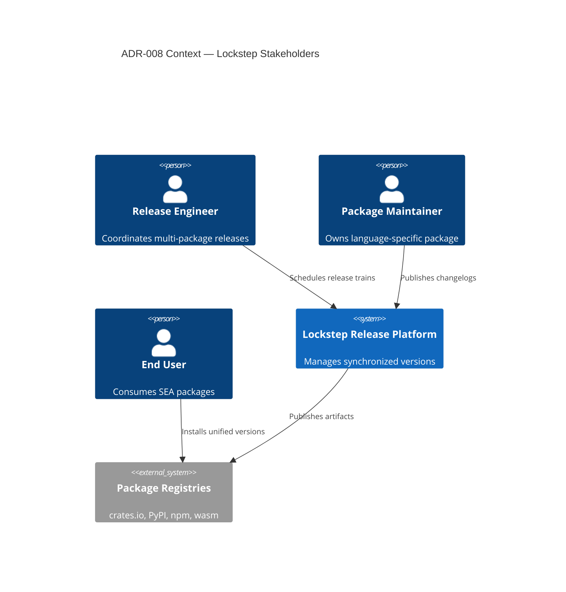

# ADR-008 — Release Ecosystem Context

Context diagram showing stakeholders impacted by version alignment across packages.

```mermaid
%% Source: ADR-008 - Lockstep Versioning Strategy
%% Generated: 2025-11-01
%% Section: Context
%% Diagram: C4Context
%% !include https://raw.githubusercontent.com/plantuml-stdlib/C4-PlantUML/main/C4_Context.puml
C4Context
  title ADR-008 Context — Lockstep Stakeholders
  Person(releaseEngineer, "Release Engineer", "Coordinates multi-package releases")
  Person(pkgMaintainer, "Package Maintainer", "Owns language-specific package")
  Person(endUser, "End User", "Consumes SEA packages")
  System(releasePlatform, "Lockstep Release Platform", "Manages synchronized versions")
  System_Ext(registryMatrix, "Package Registries", "crates.io, PyPI, npm, wasm")
  Rel(releaseEngineer, releasePlatform, "Schedules release trains")
  Rel(pkgMaintainer, releasePlatform, "Publishes changelogs")
  Rel(releasePlatform, registryMatrix, "Publishes artifacts")
  Rel(endUser, registryMatrix, "Installs unified versions")
```

- Related: [Release pressure flow](ADR-008-flow-context-pressures.md)
