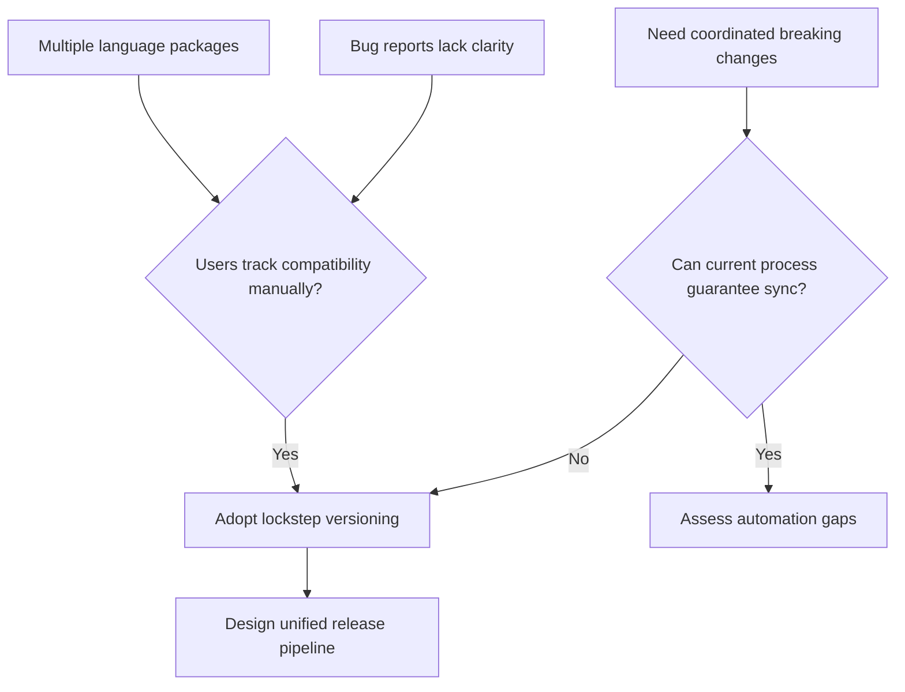

# ADR-008 — Context Pressure Flow

Flowchart summarizing release management pressures prompting lockstep versions.

```mermaid
%% Source: ADR-008 - Lockstep Versioning Strategy
%% Generated: 2025-11-01
%% Section: Context
%% Diagram: Flowchart
graph TD
  A[Multiple language packages] --> B{Users track compatibility manually?}
  C[Bug reports lack clarity] --> B
  D[Need coordinated breaking changes] --> E{Can current process guarantee sync?}
  B -->|Yes| F[Adopt lockstep versioning]
  E -->|No| F
  E -->|Yes| G[Assess automation gaps]
  F --> H[Design unified release pipeline]
```

- Related: [Versioning options matrix](ADR-008-container-versioning-options.md)
