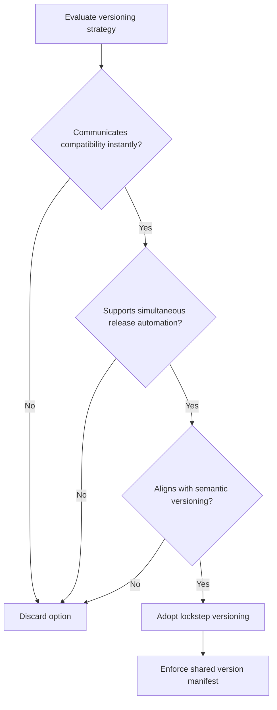

# ADR-008 — Decision Logic Flow

Flowchart illustrating evaluation steps that led to adopting lockstep versioning.

- Related: [Lockstep component architecture](ADR-008-component-lockstep-architecture.md)
