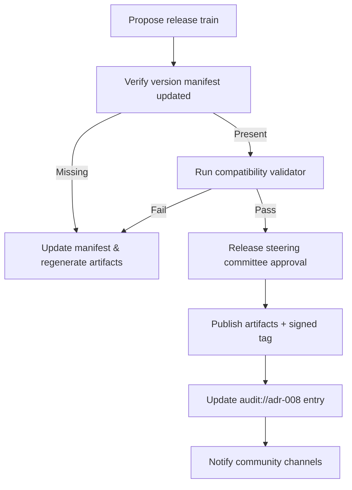

# ADR-008 — Release Governance Flow

Workflow enforcing policy compliance for lockstep releases.

```mermaid
%% Source: ADR-008 - Lockstep Versioning Strategy
%% Generated: 2025-11-01
%% Section: Governance
%% Diagram: Flowchart
graph TD
  A[Propose release train] --> B[Verify version manifest updated]
  B -->|Missing| C[Update manifest & regenerate artifacts]
  B -->|Present| D[Run compatibility validator]
  D -->|Fail| C
  D -->|Pass| E[Release steering committee approval]
  E --> F[Publish artifacts + signed tag]
  F --> G[Update audit://adr-008 entry]
  G --> H[Notify community channels]
```

- Related: [Lockstep release sequence](ADR-008-sequence-release-cadence.md)
