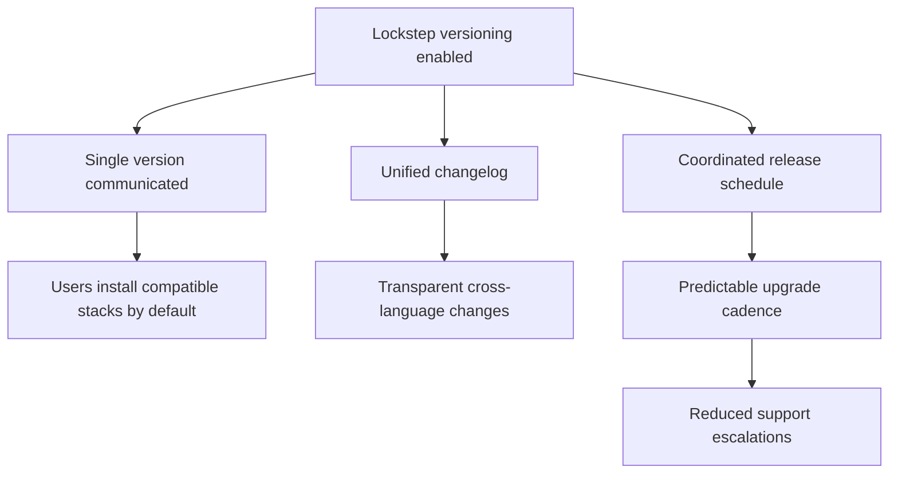

# ADR-008 — Clarity Impact Flow

Flowchart mapping outcomes achieved by adopting lockstep versioning.

```mermaid
%% Source: ADR-008 - Lockstep Versioning Strategy
%% Generated: 2025-11-01
%% Section: Impact
%% Diagram: Flowchart
graph TD
  A[Lockstep versioning enabled] --> B[Single version communicated]
  B --> C[Users install compatible stacks by default]
  A --> D[Unified changelog]
  D --> E[Transparent cross-language changes]
  A --> F[Coordinated release schedule]
  F --> G[Predictable upgrade cadence]
  G --> H[Reduced support escalations]
```

- Related: [Distribution context view](ADR-008-context-impact-distribution.md)
