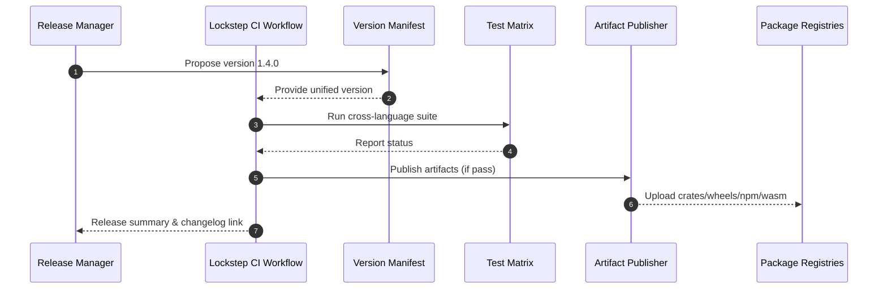

# ADR-008 — Lockstep Release Sequence

Sequence showing orchestration of a synchronized release.

```mermaid
%% Source: ADR-008 - Lockstep Versioning Strategy
%% Generated: 2025-11-01
%% Section: Implementation
%% Diagram: sequenceDiagram
sequenceDiagram
  %% !include https://raw.githubusercontent.com/plantuml-stdlib/C4-PlantUML/main/C4_Dynamic.puml
  autonumber
  participant ReleaseMgr as Release Manager
  participant CI as Lockstep CI Workflow
  participant Manifest as Version Manifest
  participant Tests as Test Matrix
  participant Publisher as Artifact Publisher
  participant Registries as Package Registries
  ReleaseMgr->>Manifest: Propose version 1.4.0
  Manifest-->>CI: Provide unified version
  CI->>Tests: Run cross-language suite
  Tests-->>CI: Report status
  CI->>Publisher: Publish artifacts (if pass)
  Publisher-->>Registries: Upload crates/wheels/npm/wasm
  CI-->>ReleaseMgr: Release summary & changelog link
```

- Related: [Lockstep pipeline components](ADR-008-component-release-pipeline.md)
