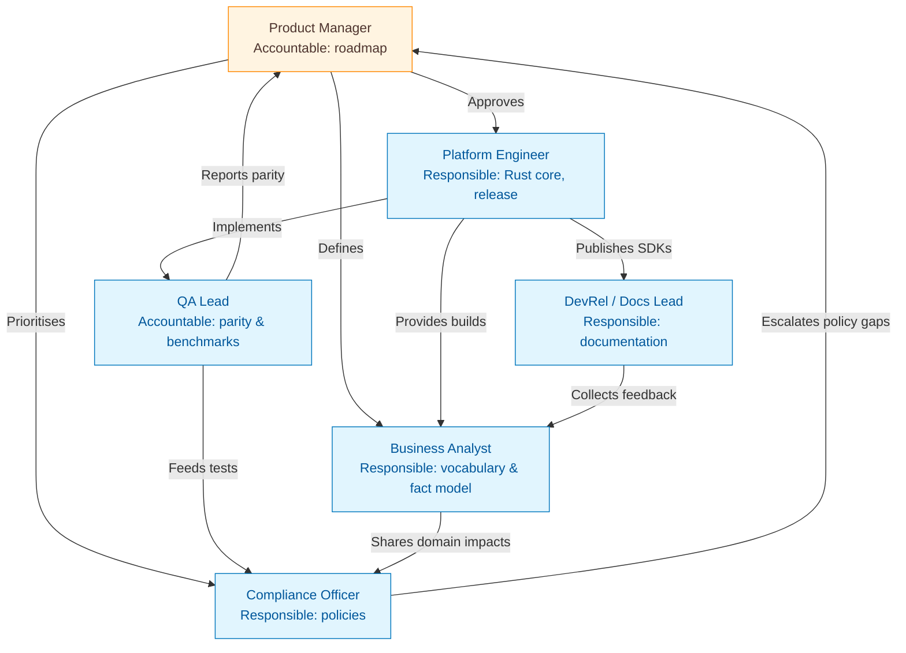

## PRD Section 3: Stakeholder Decision Map

```mermaid
graph TD
    %% Source: docs/specs/prd.md - User stories, success metrics, traceability summary
    PM[Product Manager\nAccountable: roadmap]
    PE[Platform Engineer\nResponsible: Rust core, release]
    BA[Business Analyst\nResponsible: vocabulary & fact model]
    CO[Compliance Officer\nResponsible: policies]
    QA[QA Lead\nAccountable: parity & benchmarks]
    DR[DevRel / Docs Lead\nResponsible: documentation]

    PM -->|Approves| PE
    PM -->|Defines| BA
    PM -->|Prioritises| CO
    PE -->|Implements| QA
    PE -->|Provides builds| BA
    PE -->|Publishes SDKs| DR
    QA -->|Reports parity| PM
    QA -->|Feeds tests| CO
    BA -->|Shares domain impacts| CO
    CO -->|Escalates policy gaps| PM
    DR -->|Collects feedback| BA

    %% RACI annotations
    classDef accountable fill:#fff4e1,stroke:#ff8800,color:#4e342e;
    classDef responsible fill:#e1f5fe,stroke:#0277bd,color:#01579b;
    class PM accountable;
    class PE,BA,CO,QA,DR responsible;
```
