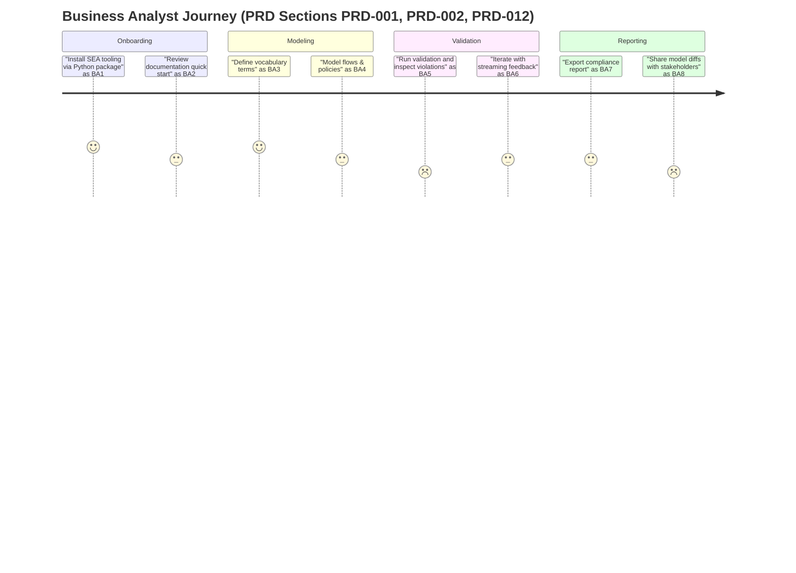

## PRD Section 6: Business Analyst Journey



- Pain points flagged at BA5 and BA8 align with PRD requirements for richer diagnostics (PRD-017) and documentation improvements (PRD-019).
- Satisfaction assumptions need validation with UX research; defaults set to neutral (3) where PRD lacks explicit signal.
```
