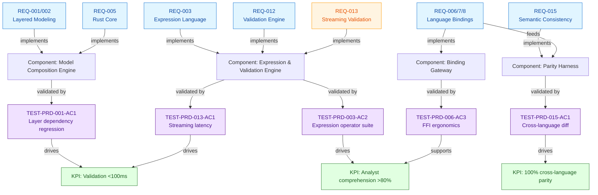

## PRD Section 7: Traceability Graph (Sample)

```mermaid
graph TD
    %% REQ nodes with mandated color coding
    REQ001[REQ-001/002\nLayered Modeling]
    REQ003[REQ-003\nExpression Language]
    REQ005[REQ-005\nRust Core]
    REQ006[REQ-006/7/8\nLanguage Bindings]
    REQ012[REQ-012\nValidation Engine]
    REQ013[REQ-013\nStreaming Validation]
    REQ015[REQ-015\nSemantic Consistency]

    COMP_CORE[Component: Model Composition Engine]
    COMP_EXPR[Component: Expression & Validation Engine]
    COMP_BIND[Component: Binding Gateway]
    COMP_PARITY[Component: Parity Harness]

    TEST_LAYER[TEST-PRD-001-AC1\nLayer dependency regression]
    TEST_EXPR[TEST-PRD-003-AC2\nExpression operator suite]
    TEST_BIND[TEST-PRD-006-AC3\nFFI ergonomics]
    TEST_STREAM[TEST-PRD-013-AC1\nStreaming latency]
    TEST_PARITY[TEST-PRD-015-AC1\nCross-language diff]

    KPI_PERF[KPI: Validation <100ms]
    KPI_USABILITY[KPI: Analyst comprehension >80%]
    KPI_PARITY[KPI: 100% cross-language parity]

    REQ001 -->|implements| COMP_CORE
    REQ003 -->|implements| COMP_EXPR
    REQ005 -->|implements| COMP_CORE
    REQ006 -->|implements| COMP_BIND
    REQ012 -->|implements| COMP_EXPR
    REQ013 -->|implements| COMP_EXPR
    REQ015 -->|implements| COMP_PARITY
    REQ006 -->|feeds| COMP_PARITY

    COMP_CORE -->|validated by| TEST_LAYER
    COMP_EXPR -->|validated by| TEST_EXPR
    COMP_BIND -->|validated by| TEST_BIND
    COMP_EXPR -->|validated by| TEST_STREAM
    COMP_PARITY -->|validated by| TEST_PARITY

    TEST_LAYER -->|drives| KPI_PERF
    TEST_EXPR -->|drives| KPI_USABILITY
    TEST_BIND -->|supports| KPI_USABILITY
    TEST_STREAM -->|drives| KPI_PERF
    TEST_PARITY -->|drives| KPI_PARITY

    %% Color coding
    style REQ001 fill:#e1f5ff,stroke:#1976d2,color:#0d47a1
    style REQ003 fill:#e1f5ff,stroke:#1976d2,color:#0d47a1
    style REQ005 fill:#e1f5ff,stroke:#1976d2,color:#0d47a1
    style REQ006 fill:#e1f5ff,stroke:#1976d2,color:#0d47a1
    style REQ012 fill:#e1f5ff,stroke:#1976d2,color:#0d47a1
    style REQ013 fill:#fff4e1,stroke:#ff9800,color:#e65100
    style REQ015 fill:#e1f5ff,stroke:#1976d2,color:#0d47a1

    classDef test fill:#f0e1ff,stroke:#6a1b9a,color:#4a148c;
    class TEST_LAYER,TEST_EXPR,TEST_BIND,TEST_STREAM,TEST_PARITY test;

    classDef metric fill:#e1ffe1,stroke:#2e7d32,color:#1b5e20;
    class KPI_PERF,KPI_USABILITY,KPI_PARITY metric;

    %% NOTE: Full traceability matrix provided in README covers remaining requirements while respecting 20-node limit here.
```
