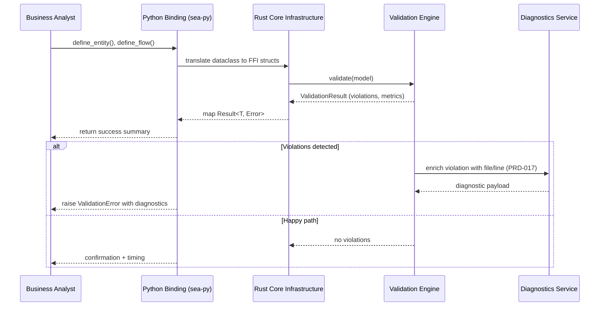

## PRD Section 8: Model Validation Sequence

```mermaid
sequenceDiagram
    %% Source: docs/specs/prd.md - PRD-001..PRD-012 & PRD-017 acceptance criteria
    participant BA as Business Analyst
    participant Py as Python Binding (sea-py)
    participant Core as Rust Core Infrastructure
    participant Engine as Validation Engine
    participant Diag as Diagnostics Service

    BA->>Py: define_entity(), define_flow()
    Py->>Core: translate dataclass to FFI structs
    Core->>Engine: validate(model)
    Engine-->>Core: ValidationResult (violations, metrics)
    Core-->>Py: map Result<T, Error>
    Py-->>BA: return success summary

    alt Violations detected
        Engine->>Diag: enrich violation with file/line (PRD-017)
        Diag-->>Engine: diagnostic payload
        Py-->>BA: raise ValidationError with diagnostics
    else Happy path
        Engine-->>Core: no violations
        Py-->>BA: confirmation + timing
    end
```
