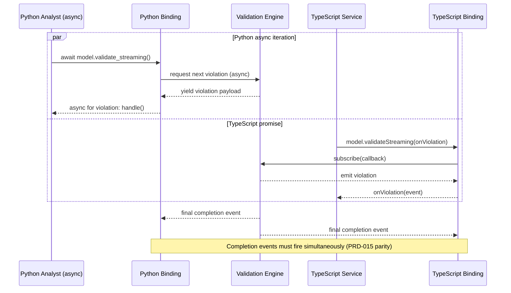

## PRD Section 8: Streaming Validation Sequence

```mermaid
sequenceDiagram
    %% Source: docs/specs/prd.md - PRD-006..PRD-008, PRD-013, PRD-015
    participant Py as Python Analyst (async)
    participant PyBind as Python Binding
    participant Engine as Validation Engine
    participant TS as TypeScript Service
    participant TSBind as TypeScript Binding

    par Python async iteration
        Py->>PyBind: await model.validate_streaming()
        PyBind->>Engine: request next violation (async)
        Engine-->>PyBind: yield violation payload
        PyBind-->>Py: async for violation: handle()
    and TypeScript promise
        TS->>TSBind: model.validateStreaming(onViolation)
        TSBind->>Engine: subscribe(callback)
        Engine-->>TSBind: emit violation
        TSBind-->>TS: onViolation(event)
    end

    Engine-->>PyBind: final completion event
    Engine-->>TSBind: final completion event
    note over PyBind,TSBind: Completion events must fire simultaneously (PRD-015 parity)
```
