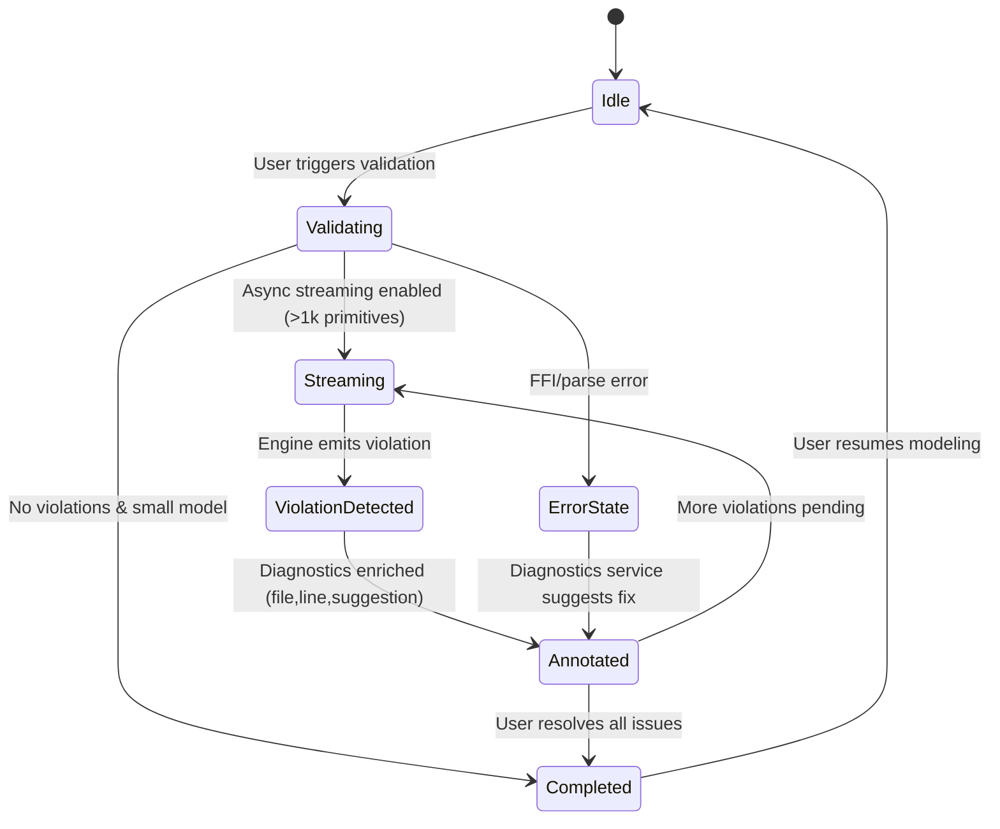

## PRD Section 8: Validation Feedback States

```mermaid
stateDiagram-v2
    %% Source: docs/specs/prd.md - PRD-012, PRD-013, PRD-017 acceptance criteria
    [*] --> Idle
    Idle --> Validating : User triggers validation
    Validating --> Streaming : Async streaming enabled (>1k primitives)
    Validating --> Completed : No violations & small model
    Streaming --> ViolationDetected : Engine emits violation
    ViolationDetected --> Annotated : Diagnostics enriched (file,line,suggestion)
    Annotated --> Streaming : More violations pending
    Annotated --> Completed : User resolves all issues
    Completed --> Idle : User resumes modeling
    Validating --> ErrorState : FFI/parse error
    ErrorState --> Annotated : Diagnostics service suggests fix
    %% WARNING: Insufficient detail on batch retry behaviour; assume manual retry.
```
