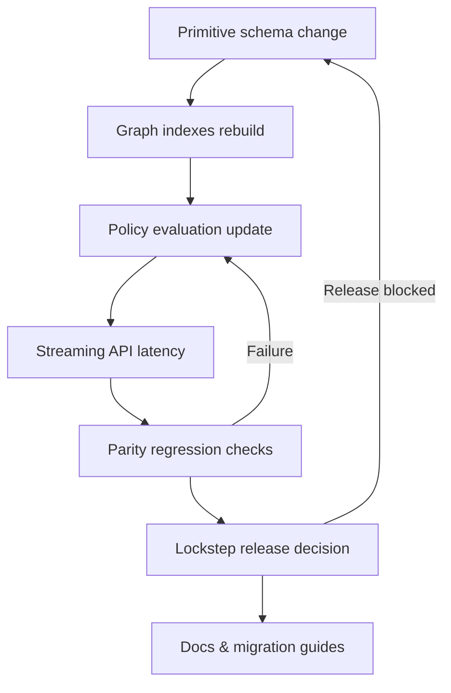

## PRD Section 9: Constraint Propagation Flow

```mermaid
graph TD
    %% Source: docs/specs/prd.md - Dependencies & success metrics
    A[Primitive schema change]
    B[Graph indexes rebuild]
    C[Policy evaluation update]
    D[Streaming API latency]
    E[Parity regression checks]
    F[Lockstep release decision]
    G[Docs & migration guides]

    A --> B
    B --> C
    C --> D
    D --> E
    E --> F
    F --> G

    %% Feedback loops
    E -->|Failure| C
    F -->|Release blocked| A

    %% WARNING: Insufficient detail on SLA for index rebuild; capture during implementation planning.
```
