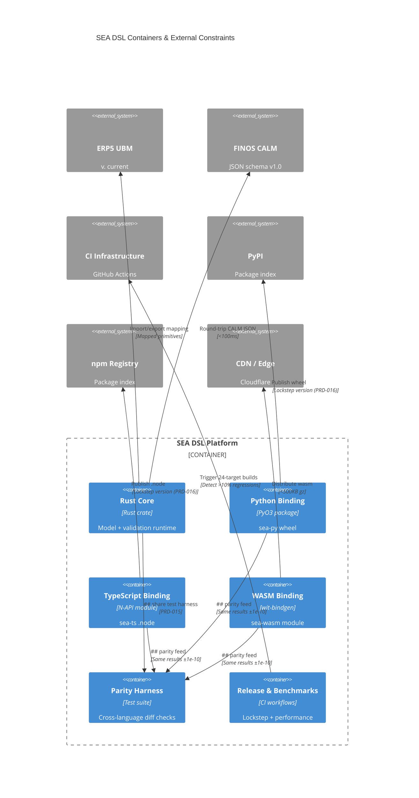

## PRD Section 9: Dependency Container Map

```mermaid
C4Container
    title SEA DSL Containers & External Constraints
    %% Source: docs/specs/prd.md - PRD-005..PRD-018

    Container_Boundary(sea, "SEA DSL Platform") {
        Container(rustCore, "Rust Core", "Rust crate", "Model + validation runtime")
        Container(pyBinding, "Python Binding", "PyO3 package", "sea-py wheel")
        Container(tsBinding, "TypeScript Binding", "N-API module", "sea-ts .node")
        Container(wasmBinding, "WASM Binding", "wit-bindgen", "sea-wasm module")
        Container(parity, "Parity Harness", "Test suite", "Cross-language diff checks")
        Container(releaseOps, "Release & Benchmarks", "CI workflows", "Lockstep + performance")
    }

    System_Ext(erp5, "ERP5 UBM", "v. current", "Migration source")
    System_Ext(calm, "FINOS CALM", "JSON schema v1.0", "Interop target")
    System_Ext(ci, "CI Infrastructure", "GitHub Actions", "24 targets")
    System_Ext(pypi, "PyPI", "Package index", "Wheel distribution")
    System_Ext(npm, "npm Registry", "Package index", ".node distribution")
    System_Ext(cdn, "CDN / Edge", "Cloudflare", "WASM delivery <=100ms")

    Rel(rustCore, parity, "## share test harness", "PRD-015")
    Rel(pyBinding, parity, "## parity feed", "Same results ±1e-10")
    Rel(tsBinding, parity, "## parity feed", "Same results ±1e-10")
    Rel(wasmBinding, parity, "## parity feed", "Same results ±1e-10")

    Rel(rustCore, erp5, "Import/export mapping", "Mapped primitives")
    Rel(rustCore, calm, "Round-trip CALM JSON", "<100ms")
    Rel(pyBinding, pypi, "Publish wheel", "Lockstep version (PRD-016)")
    Rel(tsBinding, npm, "Publish .node", "Lockstep version (PRD-016)")
    Rel(wasmBinding, cdn, "Distribute wasm", "<500KB gz")
    Rel(releaseOps, ci, "Trigger 24-target builds", "Detect >10% regressions")
```
