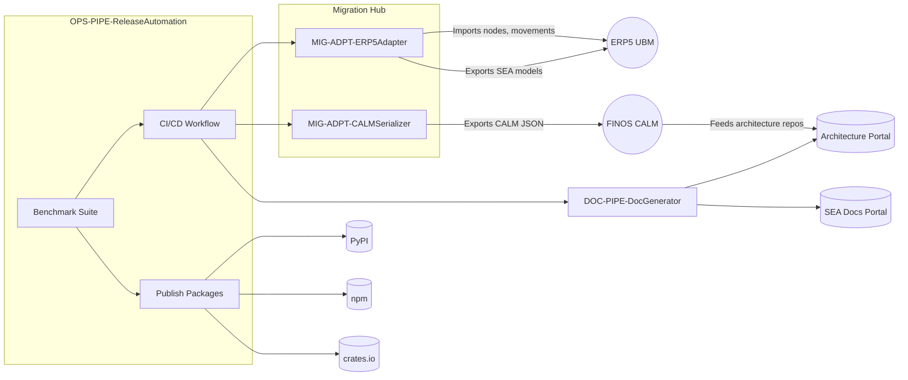

## External Integration Flow

Illustrates how migration adapters, documentation tooling, and release automation interact with ERP5, CALM, and package registries, ensuring ADR-006 interoperability and ADR-008 release discipline.

### Design Rationale
- **Migration Hub**: Splits ERP5 and CALM adapters with distinct flows while sharing CI triggers.
- **ReleaseOps**: Ensures lockstep releases run benchmarks before publishing, satisfying ADR-008.

### Related Components
- Data mapping logic detailed in [sds-data-migration-strategy](../06-data/sds-data-migration-strategy.md).
- CI job structure expanded in [sds-deployment-cicd-pipeline](../08-deployment/sds-deployment-cicd-pipeline.md).
