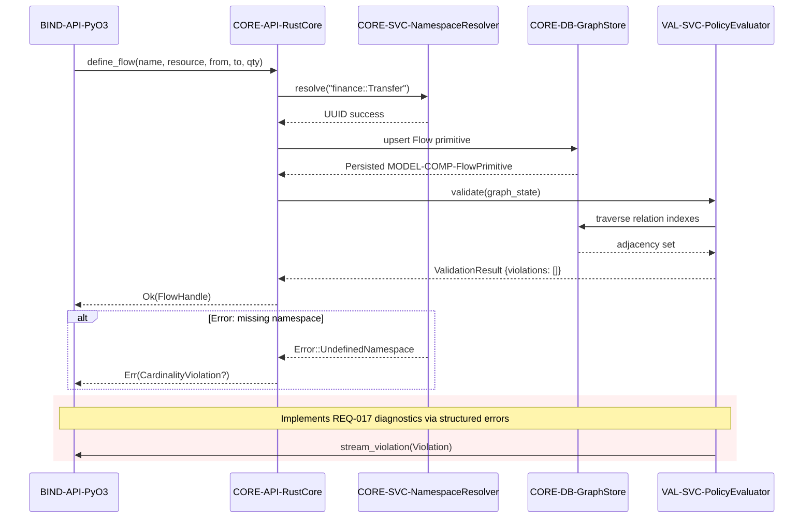

## End-to-End Modelling Sequence

Demonstrates full request lifecycle for defining a flow and validating policies, covering happy and failure paths per validation checklist.

### Design Rationale
- Combined synchronous + streaming interactions show compliance with REQ-013.
- Error alternate path ensures diagnostics remain explicit (REQ-017).

### Related Components
- Namespace resolution internals defined in [sds-component-namespace-resolver](../04-components/sds-component-namespace-resolver.md).
- Graph schema referenced in [sds-data-schema-complete](../06-data/sds-data-schema-complete.md).
