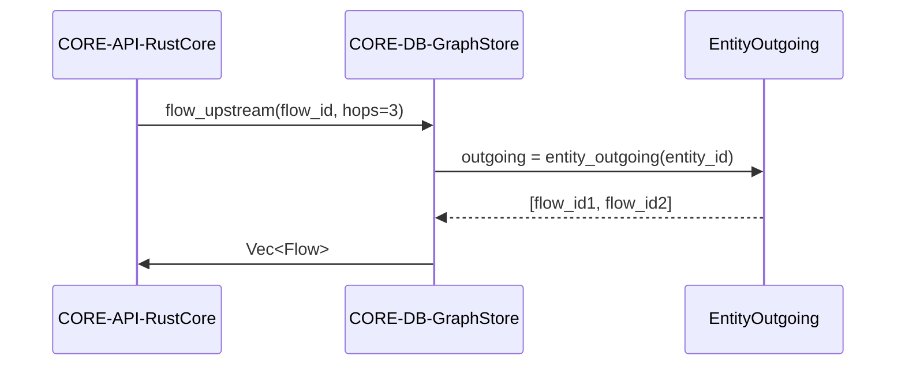

## Component Design: Graph Runtime

Captures hash maps and indexes enabling O(1) lookups and efficient policy evaluation.

```mermaid
C4Component
    %% Source: docs/specs/sds.md - SDS-005 Graph Data Structure
    %% Implements: ADR-003, ADR-005
    %% Satisfies: REQ-002, REQ-004, REQ-011, REQ-012
    %% Components: CORE-DB-GraphStore, MODEL-COMP-EntityPrimitive, MODEL-COMP-ResourcePrimitive, MODEL-COMP-FlowPrimitive, MODEL-COMP-InstancePrimitive, VAL-SVC-PolicyEvaluator

    AddElementTag("Storage", $bgColor="#ede9fe", $borderColor="#7c3aed", $fontColor="#5b21b6")
    AddElementTag("Index", $bgColor="#e0f2fe", $borderColor="#0284c7", $fontColor="#0369a1")

    Container_Boundary(graphBoundary, "CORE-DB-GraphStore", "Rust struct", $tags="Storage") {
        Component(entityMap, "EntityMap", "HashMap<Uuid, Entity>", "Stores entities", $tags="Storage")
        Component(resourceMap, "ResourceMap", "HashMap<Uuid, Resource>", "Stores resources", $tags="Storage")
        Component(flowMap, "FlowMap", "HashMap<Uuid, Flow>", "Stores flows", $tags="Storage")
        Component(instanceMap, "InstanceMap", "HashMap<Uuid, Instance>", "Stores instances", $tags="Storage")

        Component(fromIndex, "FromIndex", "HashMap<Uuid, Uuid>", "Flow → source entity", $tags="Index")
        Component(toIndex, "ToIndex", "HashMap<Uuid, Uuid>", "Flow → dest entity", $tags="Index")
        Component(resourceIndex, "MovesIndex", "HashMap<Uuid, Uuid>", "Flow → resource", $tags="Index")
        Component(entityIncoming, "EntityIncoming", "HashMap<Uuid, Vec<Uuid>>", "Entity → incoming flows", $tags="Index")
        Component(entityOutgoing, "EntityOutgoing", "HashMap<Uuid, Vec<Uuid>>", "Entity → outgoing flows", $tags="Index")
        Component(resourceFlows, "ResourceFlows", "HashMap<Uuid, Vec<Uuid>>", "Resource → flows", $tags="Index")
    }

    Component(policyEngine, "VAL-SVC-PolicyEvaluator", "Uses indexes for traversal")

    Rel(entityMap, policyEngine, "provides entity nodes")
    Rel(flowMap, policyEngine, "provides flow edges")
    Rel(resourceIndex, policyEngine, "enables resource lookups")
    Rel(entityIncoming, policyEngine, "optimises forall quantifiers")
```

### Traversal Sequence



### Design Rationale
- Index structures align with REQ-004 performance requirements (<100ms validation).
- HashMap-based storage ensures constant-time lookups for primitives.

### Related Components
- Policy evaluator’s use of indexes detailed in [sds-component-policy-engine](sds-component-policy-engine.md).
