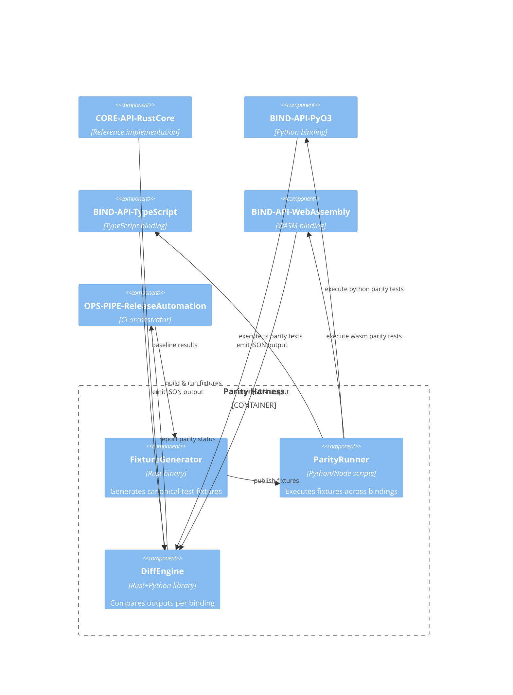
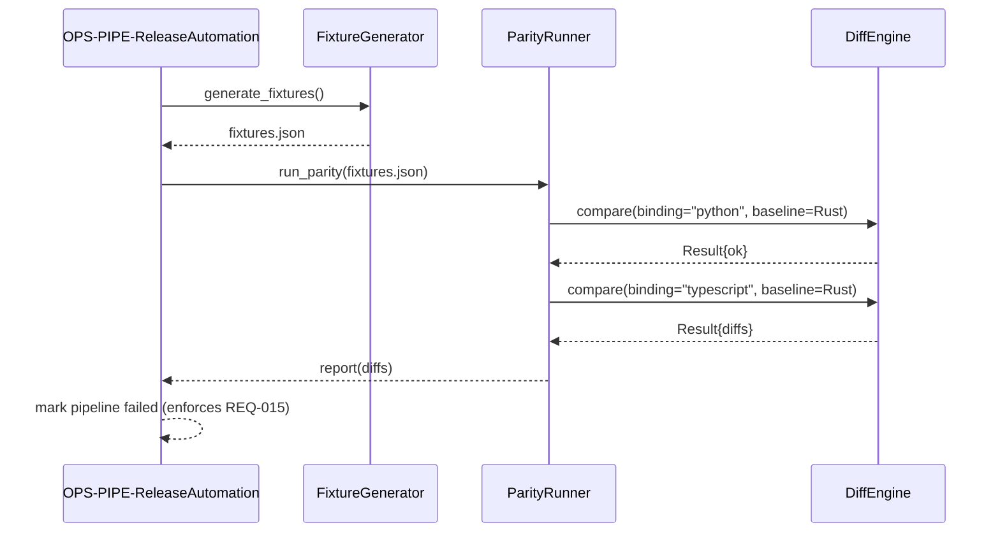

## Component Design: Language Parity Harness

Ensures cross-language parity (REQ-015) by orchestrating test vectors against each binding implementation.

### Diagnostics Sequence

### Design Rationale
- Common fixture generator prevents divergence between language implementations.
- Diff engine surfaces structured diagnostics to satisfy REQ-017.

### Related Components
- Release pipeline invoking parity harness documented in [sds-deployment-cicd-pipeline](../08-deployment/sds-deployment-cicd-pipeline.md).
