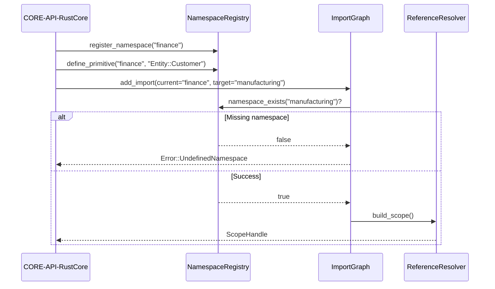

## Component Design: Namespace Resolver

Implements lazy reference resolution, ensuring Vocabulary/Fact/Rule separation mandated by ADR-001 and satisfying namespace performance targets (REQ-010).

```mermaid
C4Component
    %% Source: docs/specs/sds.md - SDS-001 Namespace Resolution
    %% Implements: ADR-001, ADR-005
    %% Satisfies: REQ-001, REQ-002, REQ-010, REQ-011
    %% Components: CORE-SVC-NamespaceResolver, MODEL-COMP-EntityPrimitive, MODEL-COMP-ResourcePrimitive

    AddElementTag("Resolver", $bgColor="#eef2ff", $borderColor="#4f46e5", $fontColor="#4338ca")
    AddElementTag("Primitive", $bgColor="#ecfdf5", $borderColor="#047857", $fontColor="#065f46")

    Container_Boundary(resolverBoundary, "CORE-SVC-NamespaceResolver", "Rust module", $tags="Resolver") {
        Component(registry, "NamespaceRegistry", "HashMap cache", "Stores namespace → symbols", $tags="Resolver")
        Component(importer, "ImportGraph", "Graph traversal", "Validates imports & detects cycles", $tags="Resolver")
        Component(resolver, "ReferenceResolver", "Resolver trait", "Resolves references lazily", $tags="Resolver")
    }

    Component(entity, "MODEL-COMP-EntityPrimitive", "Struct", "Defines entity primitives", $tags="Primitive")
    Component(resource, "MODEL-COMP-ResourcePrimitive", "Struct", "Defines resource primitives", $tags="Primitive")
    Component(flow, "MODEL-COMP-FlowPrimitive", "Struct", "Defines flow primitives", $tags="Primitive")

    Rel(entity, registry, "register_namespace", "REQ-002")
    Rel(resolver, entity, "resolve_entity", "UUID mapping")
    Rel(resolver, resource, "resolve_resource", "UUID mapping")
    Rel(resolver, flow, "resolve_flow", "UUID mapping")
    Rel(importer, registry, "populate imports", "Topological order")
    Rel(flow, importer, "validate imports", "Cycle detection")
```

### Validation Sequence



### Design Rationale
- **Registry** caches namespaces to hit <1ms lookup target.
- **ImportGraph** prevents circular dependencies (security mitigation).

### Related Components
- Graph storage integration documented in [sds-component-graph-runtime](sds-component-graph-runtime.md).
