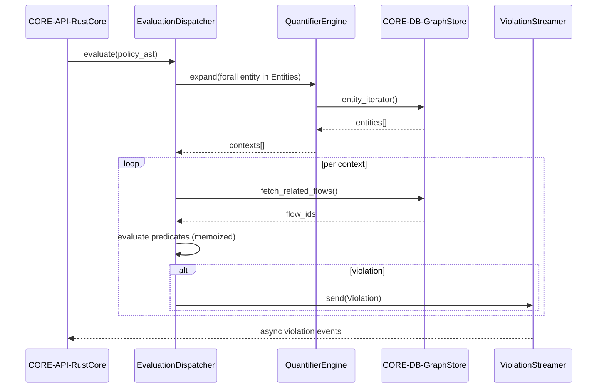

## Component Design: Policy Evaluator

Executes SBVR-aligned expressions with memoisation, streaming violations as required by PRD-013.

```mermaid
C4Component
    %% Source: docs/specs/sds.md - SDS-006 Policy Evaluator
    %% Implements: ADR-003, ADR-004
    %% Satisfies: REQ-003, REQ-004, REQ-012, REQ-013
    %% Components: VAL-SVC-PolicyEvaluator, PARSE-SVC-GrammarParser, CORE-DB-GraphStore

    AddElementTag("Evaluator", $bgColor="#fef3c7", $borderColor="#f59e0b", $fontColor="#b45309")
    AddElementTag("Cache", $bgColor="#ede9fe", $borderColor="#7c3aed", $fontColor="#5b21b6")

    Container_Boundary(policyBoundary, "VAL-SVC-PolicyEvaluator", "Rust module", $tags="Evaluator") {
        Component(dispatcher, "EvaluationDispatcher", "Executes AST nodes", $tags="Evaluator")
        Component(quantifier, "QuantifierEngine", "Expands forall/exists", $tags="Evaluator")
        Component(cache, "MemoCache", "HashMap<Node, Value>", $tags="Cache")
        Component(streamer, "ViolationStreamer", "Async channel", $tags="Evaluator")
    }

    Component(parser, "PARSE-SVC-GrammarParser", "Produces AST")
    Component(graphStore, "CORE-DB-GraphStore", "Provides traversal APIs")

    Rel(parser, dispatcher, "AST nodes")
    Rel(dispatcher, graphStore, "fetch primitives")
    Rel(quantifier, graphStore, "iterate collections")
    Rel(dispatcher, cache, "memoize results")
    Rel(dispatcher, streamer, "emit violations", "async")
```

### Evaluation Sequence



### Design Rationale
- Memoisation avoids redundant graph traversals, meeting REQ-012 performance.
- Streaming channel ensures first violation emitted <10ms (REQ-013).

### Related Components
- Streaming API integration shown in [sds-api-validation-streaming](../05-interfaces/sds-api-validation-streaming.md).
