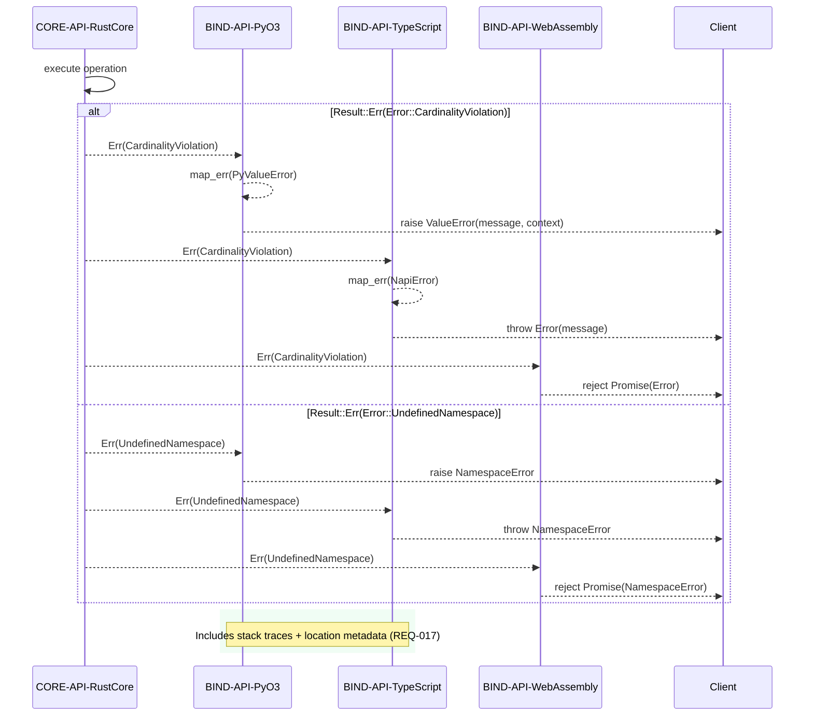

## API Sequence: FFI Error Propagation

### Design Rationale
- Normalises diagnostics to host language idioms while preserving context.
- Ensures parity harness can compare errors across bindings (REQ-015).

### Related Components
- Parity harness verification described in [sds-component-language-parity](../04-components/sds-component-language-parity.md).
