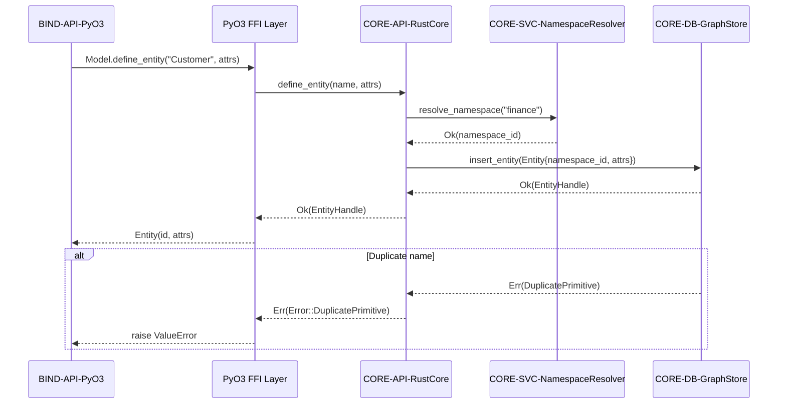

## API Sequence: Model Definition

### Design Rationale
- Ensures namespace resolution occurs before graph mutation to prevent drift.
- Error handling path emphasises mapping to Python exceptions (REQ-017).

### Related Components
- Graph internals documented in [sds-component-graph-runtime](../04-components/sds-component-graph-runtime.md).
