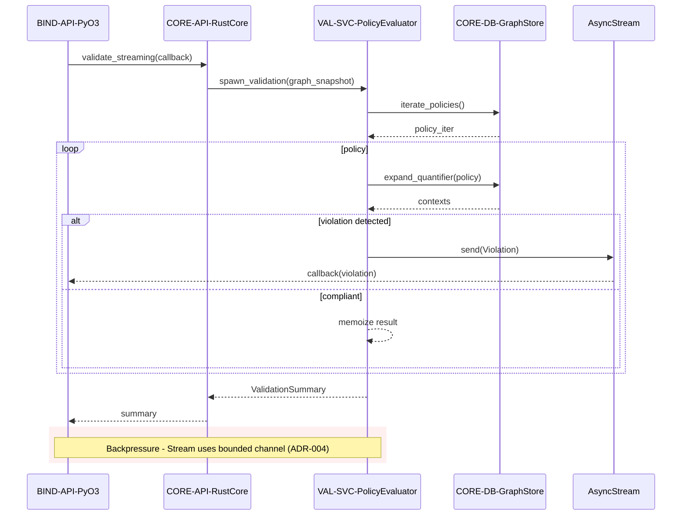

## API Sequence: Validation with Streaming

### Design Rationale
- Async stream ensures first violation delivered before evaluation completes (REQ-013).
- Bounded channel prevents memory explosion (security/performance mitigation).

### Related Components
- Error propagation for callbacks detailed in [sds-api-ffi-error-handling](sds-api-ffi-error-handling.md).
