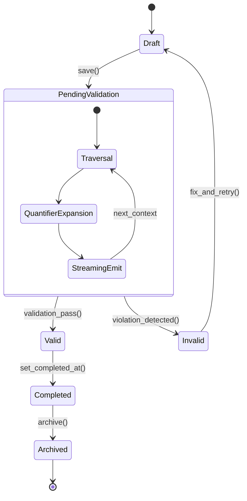

## Flow Consistency State Machine

### Design Rationale
- Captures interplay between graph persistence and policy evaluation states.
- Nested state machine summarises validation processing steps (ensures coverage for streaming).

### Related Components
- Observability metrics for state transitions defined in [sds-deployment-observability](../08-deployment/sds-deployment-observability.md).
