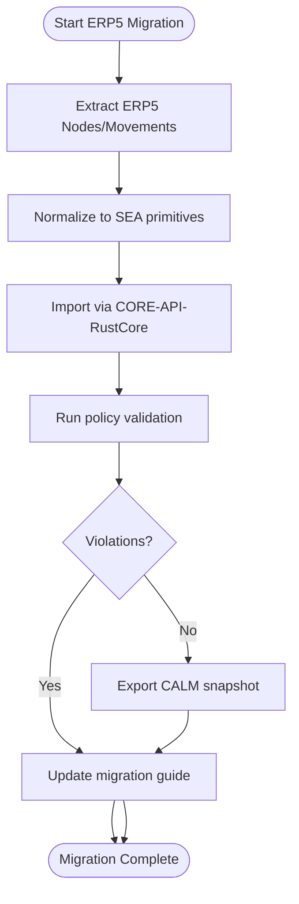

## Migration Strategy

### Design Rationale
- Ensures validation occurs before exporting CALM artifacts.
- Documentation update step ensures migration guides stay current (REQ-019).

### Related Components
- CI automation for migration regression runs described in [sds-deployment-cicd-pipeline](../08-deployment/sds-deployment-cicd-pipeline.md).
