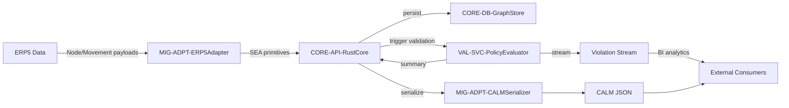

## Data Pipeline Overview

### Design Rationale
- Ensures imported data passes through validation before export.
- Exposes violation stream for analytics/regulatory reporting.

### Related Components
- Migration details by ERP5/CALM workflows in [sds-data-migration-strategy](sds-data-migration-strategy.md).
